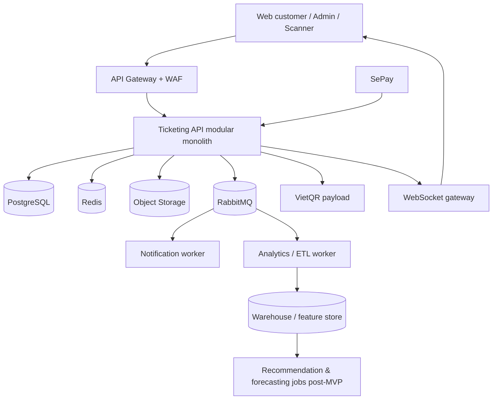

# NexaTicket — Architecture & Delivery Blueprint

## 1. Mục tiêu và phạm vi MVP

NexaTicket là nền tảng bán và quản lý vé sự kiện đa kênh (web khách hàng, web admin, scanner web; mobile native optional) với lựa chọn ghế thời gian thực, thanh toán VietQR/SePay và khả năng mở rộng AI sau khi có dữ liệu.

**Horizon thực thi:** [DELIVERY-PLAN-3M.md](../DELIVERY-PLAN-3M.md) (13 tuần).

### Personas

| Vai trò | Nhu cầu chính |
|---|---|
| Khách hàng | Tìm sự kiện, xem chi tiết, chọn ghế, thanh toán, nhận vé điện tử và quản lý đơn hàng. |
| Ban tổ chức (organizer) | Tạo sự kiện, địa điểm, sơ đồ ghế, hạng vé, khuyến mãi và xem số liệu. |
| Nhân viên soát vé | Quét QR, xác thực vé online và xử lý check-in ngoại lệ có audit. |
| Quản trị viên | Quản lý tenant, người dùng, sự kiện và vận hành. |

### MVP (phát hành đầu tiên — 3 tháng)

- Xác thực OIDC, RBAC, tổ chức/tenant và hồ sơ người dùng.
- Admin quản lý venue, seat map, event, ticket tier, promotion và bank account nhận tiền.
- Catalog/search sự kiện; trang chi tiết; lựa chọn ghế realtime.
- Giữ ghế TTL 5 phút; tạo đơn → ghế RESERVED payment window 15 phút; VietQR + SePay; QR ticket; check-in online.
- Dashboard: GMV, đơn, tỷ lệ thanh toán, ghế bán/giữ/trống.
- Observability, audit log, rate limiting và load test 10.000 concurrent.

Không đưa vào MVP 3 tháng: marketplace bên thứ ba, dynamic pricing, nhiều cổng thanh toán, offline check-in, recommendation/forecast production, hóa đơn điện tử tích hợp.

Quyết định đã đóng: [product-decisions.md](product-decisions.md). SRS: [srs.md](srs.md).

## 2. Kiến trúc đề xuất

Khởi đầu bằng **modular monolith** theo domain.



### Technology baseline

- **Frontend:** Next.js (customer + admin + scanner web). React Native chỉ nếu còn buffer tuần 13 hoặc post-MVP.
- **Backend:** Java 21 / Spring Boot modular monolith.
- **Data:** PostgreSQL system of record; Redis coordination/cache; không MongoDB cho transactional core.
- **Async:** RabbitMQ MVP; Kafka khi evidence yêu cầu.
- **Auth:** OIDC (Keycloak hoặc managed tương đương); MFA admin.
- **Infra:** Docker, managed PostgreSQL/Redis, object storage, OpenTelemetry, Prometheus/Grafana, centralized logs.

## 3. Domain boundaries

| Module | Owns | Emits events |
|---|---|---|
| Identity | users, roles, sessions, tenant membership | `UserRegistered` |
| Catalog | venues, seat maps, events, schedules, ticket tiers, promotions | `EventPublished`, `EventUpdated` |
| Inventory | seat availability and holds | `SeatHeld`, `SeatReleased`, `SeatsReserved` |
| Orders | carts, orders, price snapshots, promotions applied | `OrderCreated`, `OrderExpired`, `OrderPaid` |
| Payments | bank_accounts, payment attempts, SePay callbacks, refunds | `PaymentSucceeded`, `PaymentFailed`, `RefundCompleted` |
| Tickets | ticket issuance, QR token, check-in | `TicketIssued`, `TicketCheckedIn` |
| Notifications | delivery preferences and message delivery | `NotificationRequested` |
| Analytics | immutable business-event projection | none required for sync paths |

Cross-module writes qua service in-process; integration events qua **outbox** sau commit.

## 4. Data model (transactional core)

```text
organizations 1--* users (via organization_members)
organizations 1--* venues 1--* venue_seat_maps 1--* seat_map_seats
organizations 1--* events 1--* event_sessions 1--* session_seats
event_sessions 1--* ticket_tiers
users 1--* seat_holds --* session_seats
users 1--* orders 1--* order_items --1 session_seats
orders 1--* payment_attempts
organizations 1--* bank_accounts
order_items 1--1 tickets 1--* check_ins
```

Chi tiết cột/enum/state: [../01-foundation/data-model.md](../01-foundation/data-model.md).

Key design rules:

- `session_seats` là snapshot theo event session; không mutate venue map khi bán.
- Snapshot giá/promo trong `order_items`.
- Unique `(event_session_id, seat_id)` và `tickets.qr_jti`.
- External callback: `provider_event_id` / `sepay_transaction_id` unique.
- PII tách analytics identifiers; encrypt dữ liệu nhạy cảm at rest.

## 5. Correctness-critical seat & payment workflow

Server authoritative.

1. `POST /v1/sessions/{id}/holds` + Idempotency-Key.
2. Redis Lua atomic verify + `hold:{sessionId}:{seatId}` TTL **5 phút**; persist `seat_holds` ACTIVE.
3. Redis fail → retryable; không fallback DB không phối hợp.
4. Broadcast `seat.availability.changed` (versioned).
5. `POST /v1/orders`: revalidate hold owner/TTL → order `AWAITING_PAYMENT` → seats `RESERVED` với **payment window 15 phút**; snapshot bank account + `payment_reference` + VietQR.
6. SePay webhook verified + idempotent: success → `PAID` + issue tickets + outbox. Failure/timeout/expiry worker: release reservation + availability event. Late valid transfer → `MANUAL_REVIEW` (không auto-issue).

DB reservation là guard cuối. Hold expiry async + sync check khi tạo order. Chi tiết: ADR-0004, ADR-0015.

## 6. API and realtime contract

| Endpoint / channel | Purpose |
|---|---|
| `GET /v1/events?query=&from=&city=` | Search and discovery. |
| `GET /v1/events/{slug}` | Public event details and ticket tiers. |
| `GET /v1/sessions/{id}/seats` | Seat map plus availability version. |
| `POST /v1/sessions/{id}/holds` | Atomically hold 1..N seats; idempotent. |
| `DELETE /v1/holds/{id}` | Release a customer hold. |
| `POST /v1/orders` | Convert owned holds into payment-ready order + VietQR. |
| `POST /api/billing/bank/webhook/sepay` | SePay callback (external path). |
| `GET /v1/tickets/{id}` | Authenticated ticket view and QR payload. |
| `POST /v1/check-ins` | Online scanner check-in. |
| `seat.availability.changed` | WebSocket: session, version, changed seats. |

Mutating requests: `Idempotency-Key` ≥ 24h. Rate limit: public by IP; authenticated by user+tenant.

Contracts chi tiết: milestone 02/03 API docs.

## 7. Security, privacy and operations

- OIDC, short-lived access, rotating refresh, MFA admin.
- RBAC + org scope; never trust client organization IDs.
- Verify SePay auth; replay window; payload hash.
- QR: signed opaque JTI; no PII.
- Audit admin/financial: actor, tenant, before/after, correlation ID.
- SLOs: 99.9% availability; p95 seat-hold &lt;300 ms; RPO ≤5 min.
- OTel; alerts: hold errors, webhook failures, queue lag, oversell, check-in spikes.

## 8. AI roadmap (sau tháng 3 trừ instrumentation)

AI chỉ consume events async; không tham gia checkout.

1. Instrument taxonomy (trong 3 tháng).
2. Content-based recommendation + deterministic fallback (post-MVP).
3. Collaborative filtering khi đủ density.
4. Sentiment / forecasting sau khi có retention policy và data.

## 9. Delivery phases (map 13 tuần)

| Phase | Deliverable | Exit gate | Tuần |
|---|---|---|---|
| 0 — Discovery | SRS, RBAC, legal, metrics, quyết định đóng | Stakeholder approve | 1 |
| 1 — Foundation | Repo, CI/CD, auth, tenant, migrations, OTel | Staging deploy | 2–3 |
| 2 — Catalog/Admin | Venue/map/event/tier/promo/bank | Organizer publish E2E | 4–6 |
| 3 — Seat & Checkout | Holds, WS, order, SePay, tickets | No oversell @ 10k | 7–10 |
| 4 — Operations | Check-in, dashboard, notify, refund | Event-day drill | 11–12 |
| Buffer | Hardening + soft launch | Go/No-go | 13 |
| 5 — AI & scale | Models / capacity | Post-MVP | ongoing |

## 10. Test strategy

- Unit: pricing, promo, hold state machine, webhook signature, ticket token.
- Integration (Testcontainers): PG + Redis, transactions, outbox, idempotency, tenant/IDOR.
- Contract: SePay webhook, WebSocket payloads, OpenAPI.
- E2E: search → hold → sandbox pay → ticket → check-in.
- Load: 10.000 concurrent hot session; exactly one reservation/seat; p95 bound; recovery Redis/worker restart.
- Security: authz matrix, IDOR, webhook replay, rate limit, dependency scan.

## 11. Quyết định trước implementation

**Đã đóng.** Xem [product-decisions.md](product-decisions.md). Không còn blocker mở cho kickoff Foundation.
