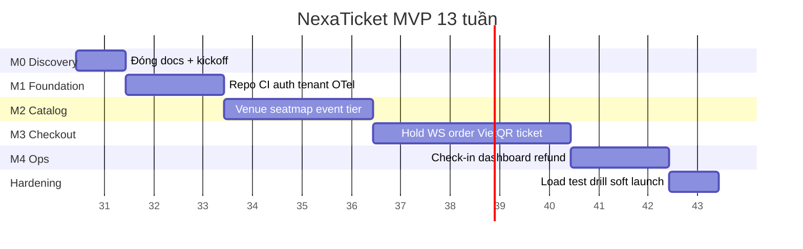

# NexaTicket — Kế hoạch giao hàng 3 tháng (13 tuần)

## Mục tiêu cuối kỳ

Trong **13 tuần**, ship MVP production-ready cho thị trường Việt Nam:

- Customer **web responsive** (điện thoại + desktop): discovery → chọn ghế realtime → VietQR → nhận vé QR.
- Admin/organizer web: venue, seat map, event, tier, promotion, bank account, dashboard cơ bản.
- Check-in **scanner web** trên điện thoại staff (PWA optional).
- React Native **không** là gate go-live; spec đầy đủ [ui/mobile](ui/mobile/README.md).
- Không oversell ở tải mục tiêu; observability, audit, rate limit, runbook event-day đã drill.

**Ngoài scope 3 tháng:** App Store/Play bắt buộc, marketplace, dynamic pricing, nhiều cổng thanh toán, recommendation/forecast production, offline check-in.

## Giả định đội ngũ

| Vai trò | Số lượng gợi ý | Trách nhiệm chính |
| --- | --- | --- |
| Backend (Spring Boot) | 2 | Modular monolith, seat/order/payment |
| Frontend (Next.js) | 2 | Customer + admin |
| Mobile (RN) | 0–1 | Sau tuần 10 nếu buffer; hoặc share FE |
| DevOps / QA shared | 0.5–1 | CI/CD, staging, load test, security smoke |

Nếu đội nhỏ hơn (3 người): ưu tiên customer web + admin web + API; mobile native đẩy sau soft launch.

## Timeline tổng quan

| Tuần | Milestone | Deliverable chính | Exit gate |
| --- | --- | --- | --- |
| 1 | 00 Discovery close | SRS, RBAC, schema v1, API outline, metrics, legal VN | Stakeholder sign-off MVP |
| 2–3 | 01 Foundation | Monorepo, CI, OIDC, tenant guard, migrations skeleton, OTel | Deploy staging xanh |
| 4–6 | 02 Catalog/Admin | CRUD venue/map/event/tier/promo + publish + customer catalog | Organizer publish E2E |
| 7–10 | 03 Seat/Checkout | Hold Redis+DB, WS, order, VietQR/SePay, ticket issue | Load test 10k: no oversell |
| 11–12 | 04 Operations | Check-in, dashboard, notification, refund/reconcile | Event-day drill pass |
| 13 | Buffer | Bug bash, security smoke, runbook, soft launch | Go/No-go production |

## Định nghĩa “Done” theo tháng

### Tháng 1 (tuần 1–4) — Nền + catalog khởi đầu

- Docs và quyết định sản phẩm đóng (không còn mục “decisions needed” mở).
- Staging deploy: health, auth login, tenant isolation test xanh.
- Organizer tạo được venue draft và seat map cơ bản (có thể chưa publish full).

### Tháng 2 (tuần 5–8) — Catalog hoàn + checkout lõi

- Publish event → customer search/detail.
- Hold ghế + WebSocket availability; tạo order + hiện VietQR.
- Webhook SePay sandbox: PAID → issue ticket (happy path + duplicate webhook).

### Tháng 3 (tuần 9–13) — Checkout cứng + vận hành

- Expiry worker, late payment `MANUAL_REVIEW`, refund path có audit.
- Check-in online; dashboard GMV/đơn/ghế; notification email/SMS tối thiểu.
- Load test, security matrix, soft launch 1–2 event thật hoặc pilot.

## Ưu tiên cắt scope nếu trễ

Cắt theo thứ tự (cắt sớm, không cắt correctness):

1. React Native app / PWA polish → giữ mobile **browser** QA.
2. Promotion phức tạp → chỉ mã giảm giá % / số tiền cố định.
3. Dashboard nâng cao → 4 metric cố định + CSV export.
4. Notification đa kênh → email only.
5. AI → chỉ instrument event taxonomy; không train model.

**Không cắt:** tenant isolation, hold atomicity, DB reservation guard, webhook idempotency, unique ticket JTI, audit financial.

## Nghiệm thu cuối (Go/No-go)

| # | Tiêu chí | Pass |
| --- | --- | --- |
| 1 | E2E: search → hold → transfer sandbox → ticket → check-in | Có |
| 2 | Load: 10.000 concurrent trên hot session; 0 oversell | Có |
| 3 | p95 seat-hold ≤ 300 ms ở môi trường test đã chốt | Có |
| 4 | Webhook duplicate/late không phát hành vé sai | Có |
| 5 | IDOR/tenant tests xanh; secrets không trong repo | Có |
| 6 | Event-day runbook drill có biên bản | Có |
| 7 | RPO restore drill ≤ 5 phút (staging backup) | Có |

## RACI ngắn

| Quyết định | R | A | C |
| --- | --- | --- | --- |
| Scope MVP / cắt scope | PM | Stakeholder | Tech lead |
| ADR kỹ thuật | Tech lead | Tech lead | BE/FE |
| Payment/refund policy | PM + Finance | Stakeholder | BE |
| Go-live | Tech lead + PM | Stakeholder | Ops |

## Liên kết artifact theo milestone

- [00 Discovery](00-discovery/README.md)
- [UI / UX](ui/README.md)
- [Mobile](ui/mobile/README.md)
- [01 Foundation](01-foundation/README.md)
- [02 Catalog/Admin](02-catalog-admin/README.md)
- [03 Seat/Checkout](03-seat-checkout/README.md)
- [04 Operations](04-operations/README.md)
- [05 AI (instrumentation only trong 3 tháng)](05-ai-scale/README.md)
