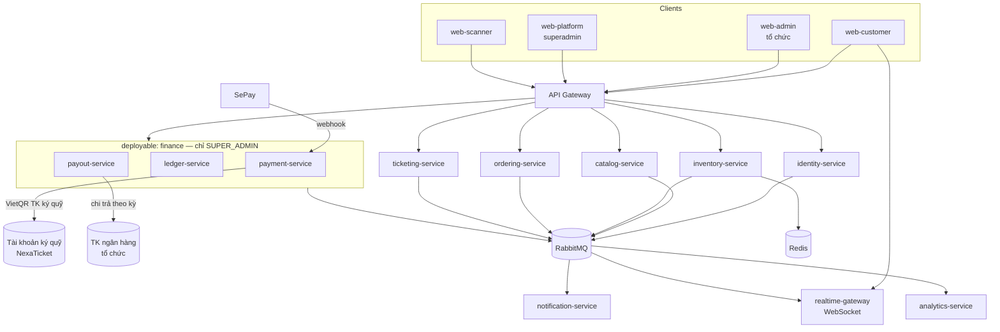

# NexaTicket — Kiến trúc v2: Microservices + DDD + Custodial funds

Thiết kế lại theo các yêu cầu đã chốt:

1. **Microservices** thay cho modular monolith.
2. **Domain-Driven Design** — chiến lược (bounded context) và chiến thuật (aggregate, VO, domain event).
3. **NexaTicket là bên giữ tiền**; **superadmin quản lý toàn bộ tiền**.
4. **Superadmin tạo ra các tổ chức**; tổ chức tạo sự kiện, sắp xếp ghế, chọn địa điểm, và tự thêm nhân viên soát vé.
5. **Một địa điểm dùng chung cho nhiều tổ chức**: mỗi tổ chức tự thiết kế khu vực ghế cho từng sự kiện, riêng **khu vực ghế áp cứng thì không đổi được**. Tổ chức cũng tạo được **địa điểm riêng**.
6. **Concert toàn ghế ngồi, vừa ngồi vừa đứng, hoặc chỉ đứng** — cả ba đều hỗ trợ.
7. **Tổ chức chỉ biết số tiền và số vé đã bán** — không thấy sổ cái, số dư, hoa hồng hay chi trả.
8. **Chỉ dùng RabbitMQ**, không dùng Kafka.

> Tài liệu v1 (`docs/00-discovery` … `docs/05-ai-scale`) **giữ nguyên** làm nguồn nghiệp vụ: SRS, RBAC, UI, state machine, quy tắc hold/payment window vẫn đúng. v2 chỉ thay **kiến trúc kỹ thuật** và **mô hình dòng tiền**.

## Mục lục

| Tài liệu | Nội dung |
| --- | --- |
| [context-map.md](context-map.md) | DDD chiến lược: subdomain, bounded context, context map, ubiquitous language |
| [services.md](services.md) | 11 service + gateway: trách nhiệm, API, dữ liệu sở hữu, mô hình vai trò |
| [venue-seating-model.md](venue-seating-model.md) | **Địa điểm dùng chung**: zone cố định vs linh hoạt, thiết kế chỗ ngồi theo sự kiện |
| [tactical-ddd.md](tactical-ddd.md) | Aggregate, entity, value object, domain event, cấu trúc code hexagonal |
| [custodial-funds.md](custodial-funds.md) | **Mô hình giữ tiền**: sổ cái kép, chart of accounts, chi trả, pháp lý |
| [sagas.md](sagas.md) | Giao dịch phân tán: checkout, payment, refund, payout |
| [ui-direction.md](ui-direction.md) | **Hướng thiết kế giao diện v2** — nền sáng, đỏ ấm, bố cục kiểu site bán vé VN |
| [plan/README.md](plan/README.md) | **Kế hoạch triển khai**: monorepo, starter, RabbitMQ topology, CI |
| [plan/backend.md](plan/backend.md) | 11 service Spring Boot, giai đoạn G0–G7 |
| [plan/frontend.md](plan/frontend.md) | 4 app Next.js |
| [CHANGELOG.md](CHANGELOG.md) | Lịch sử sửa đổi kiến trúc v2 |
| [adr/](adr/) | ADR-1001…1013 |

## Quan hệ với ADR v1

| ADR v1 | Trạng thái | Ghi chú |
| --- | --- | --- |
| ADR-0001 modular monolith | **Superseded** | [ADR-1001](adr/ADR-1001-microservices.md) — microservices |
| ADR-0003 PostgreSQL SoR | Sửa đổi | Vẫn PostgreSQL, nhưng **database per service** ([ADR-1002](adr/ADR-1002-database-per-service.md)) |
| **ADR-0006 RabbitMQ** | **Vẫn hiệu lực** | [ADR-1009](adr/ADR-1009-rabbitmq-only.md) khôi phục và mở rộng (outbox = nhật ký sự kiện) |
| **ADR-0008 tenant isolation** | **Vẫn hiệu lực** | [ADR-1010](adr/ADR-1010-superadmin-tenancy-and-finance-visibility.md) giữ nguyên mô hình platform admin tạo tenant của v1 |
| ADR-0013 VietQR vào TK organizer | **Superseded** | [ADR-1004](adr/ADR-1004-custodial-funds.md) — tiền vào TK ký quỹ nền tảng |
| `data-model.md` seat map (v1) | **Superseded** | [ADR-1011](adr/ADR-1011-shared-venue-fixed-and-flexible-zones.md) — địa điểm dùng chung, zone cố định/linh hoạt |
| **ADR-0008** (ngoại lệ hẹp) | Sửa đổi | [ADR-1013](adr/ADR-1013-venue-schedule-conflict-warning.md) — một truy vấn xuyên tenant có kiểm soát để phát hiện trùng lịch |
| ADR-0002, 0004, 0005, 0007, 0009, 0010, 0011, 0012, 0014, 0015, 0016 | **Giữ nguyên** | Vẫn đúng trong kiến trúc mới |

`docs/00-discovery/legal-constraints-vn.md §3` (tiền vào TK organizer, NexaTicket không giữ tiền) **không còn đúng** — xem [custodial-funds.md §9](custodial-funds.md#9-pháp-lý--bắt-buộc-đọc).

Hai ADR trung gian đã bị thay thế và giữ lại chỉ để ghi lý do: [ADR-1003](adr/ADR-1003-kafka-event-backbone.md) (Kafka) và [ADR-1007](adr/ADR-1007-self-service-organizations.md) (tự tạo tổ chức).

---

## 1. Bản đồ hệ thống

Đường tiền đổi chiều so với v1: khách chuyển vào **tài khoản ký quỹ của NexaTicket**, không phải tài khoản organizer. Tài khoản ngân hàng của tổ chức từ nay là **đích chi trả**, do superadmin nhập và quản lý.

## 2. Ba thay đổi thật so với v1

| # | v1 | v2 | Hệ quả |
| --- | --- | --- | --- |
| 1 | 1 deployable, 8 module | 11 service + gateway | Không còn transaction xuyên module → **saga** |
| 2 | 1 PostgreSQL | Database per service | Không còn JOIN xuyên context → event-carried state |
| 3 | Tiền vào TK organizer | **Tiền vào TK ký quỹ, superadmin quản lý** | Cần sổ cái kép, chi trả có phê duyệt, và **giấy phép** |

Hai thứ **không** thay đổi so với v1, dù bản v2 trước đó từng đề xuất đổi:

- **RabbitMQ** vẫn là trục bất đồng bộ (ADR-0006 giữ nguyên). Đề xuất chuyển Kafka đã bị bác.
- **Superadmin tạo tổ chức** — đúng như RBAC matrix v1 vốn đã quy định (`Platform tenant create/suspend` chỉ thuộc platform admin). Đề xuất cho tự tạo tổ chức đã bị bác.

Thay đổi #3 là thay đổi nặng nhất — nó biến NexaTicket từ một phần mềm bán vé thành **một hệ thống tài chính**. Rủi ro gian lận, nghĩa vụ hoàn tiền và trách nhiệm pháp lý chuyển từ organizer sang nền tảng. Toàn bộ [custodial-funds.md](custodial-funds.md) dành cho việc này.

## 3. Ai làm được gì

| | `SUPER_ADMIN` | Tổ chức (`ORG_*`, `EVENT_MANAGER`) | `CHECKIN_STAFF` | Khách |
| --- | :---: | :---: | :---: | :---: |
| Tạo / khoá tổ chức | ✅ | — | — | — |
| Mời thành viên, thêm nhân viên soát vé | ✅ | ✅ | — | — |
| Tạo địa điểm **dùng chung** + ghế áp cứng trên đó | ✅ | ❌ | — | — |
| Tạo địa điểm **riêng** + ghế áp cứng trên đó | ✅ | ✅ | — | — |
| Thiết kế chỗ ngồi cho sự kiện của mình (ngồi / đứng / hỗn hợp) | ✅ | ✅ | — | — |
| Xử lý hàng đợi trùng lịch địa điểm | ✅ | ❌ *(chỉ nhận cảnh báo)* | — | — |
| Tạo & publish sự kiện, hạng vé, khuyến mãi | ✅ | ✅ | — | — |
| Soát vé QR | ✅ | ✅ | ✅ | — |
| Xem **số vé đã bán + số tiền đã bán** | ✅ | ✅ | — | — |
| Xem ghế còn trống, lượt check-in | ✅ | ✅ | — | — |
| Sổ cái, số dư, hoa hồng, đối soát | ✅ | ❌ | — | — |
| Tài khoản ký quỹ, tài khoản chi trả | ✅ | ❌ | — | — |
| Chi trả, hoàn tiền | ✅ | ❌ | — | — |
| Mua vé, xem vé của mình | — | — | — | ✅ |

## 4. Hằng số nghiệp vụ

Danh sách chính thức của kiến trúc v2. Khai ở một chỗ duy nhất phía backend.

| Hằng số | Giá trị | Ghi chú |
| --- | --- | --- |
| `HOLD_TTL` | 5 phút | ADR-0015 |
| `PAYMENT_WINDOW` | 15 phút | ADR-0015 |
| `IDEMPOTENCY_TTL` | 24 giờ | ADR-0007 |
| `VENUE_SETUP_MINUTES` | **240** (mặc định) | Đệm dựng; superadmin chỉnh theo từng địa điểm |
| `VENUE_TEARDOWN_MINUTES` | **180** (mặc định) | Đệm tháo; superadmin chỉnh theo từng địa điểm |
| `WS_COALESCE_WINDOW` | 200 ms | Chống storm WebSocket |
| `HOLD_PERIOD_AFTER_EVENT` | 3 ngày làm việc | Kỳ giữ tiền, [custodial-funds §7](custodial-funds.md#7-kỳ-giữ-tiền-dự-phòng-và-chi-trả) |
| `REFUND_RESERVE_PCT` | 5% | Dự phòng hoàn tiền |

Đệm dựng/tháo gợi ý theo quy mô: quán cà phê / sân khấu nhỏ 60–120 phút; nhà hát 500–2.000 chỗ 240 phút; sân vận động 1–2 ngày. Superadmin hỏi chủ địa điểm rồi đặt lúc tạo venue.

### Trần mua vé — tổ chức cấu hình ([ADR-1014](adr/ADR-1014-configurable-purchase-limits.md))

Ba tầng: **trần nền tảng** (superadmin, cứng) → **mặc định tổ chức** → **ghi đè theo suất diễn**.
Giá trị hiệu lực = `coalesce(suất diễn, tổ chức, nền tảng)`; vượt trần nền tảng bị từ chối ngay lúc lưu.

| Tham số | Trần nền tảng mặc định | Ý nghĩa |
| --- | --- | --- |
| `max_seated_per_hold` | 8 | Vé ngồi mỗi lần giữ chỗ |
| `max_standing_per_hold` | 10 | Vé đứng mỗi lần giữ chỗ |
| `max_units_per_hold` | 10 | Trần tổng một lần giữ chỗ hỗn hợp |
| `max_tickets_per_customer` | 10 | **Cộng dồn mỗi tài khoản trên mỗi suất diễn** — công cụ chống gom vé |

Quy tắc giữ chỗ hỗn hợp: ngồi ≤ `max_seated`, đứng ≤ `max_standing`, tổng ≤ `max_units`.
Ví dụ với mặc định: 8 ngồi + 2 đứng ✅ · 0 ngồi + 10 đứng ✅ · 8 ngồi + 5 đứng ❌ · 9 ngồi ❌.

Trần cộng dồn tính các chỗ đang `HELD`, `RESERVED` và `SOLD` của tài khoản đó; chỗ đã nhả, đơn hết hạn và vé đã hoàn tiền tự động được trả lại hạn mức.

## 5. Nguyên tắc kiến trúc

1. **Bounded context = service = database.** Không service nào đọc bảng của service khác.
2. **Domain thuần, không framework.** Aggregate không có annotation JPA. Persistence là adapter.
3. **Đồng bộ khi người dùng đang chờ, bất đồng bộ cho phần còn lại.** Checkout gọi sync; phát hành vé, ghi sổ, gửi mail đi qua message.
4. **Mọi thứ idempotent, và không phụ thuộc thứ tự message.** RabbitMQ không bảo đảm thứ tự — mọi handler viết theo điều kiện trạng thái ([ADR-1009 §4](adr/ADR-1009-rabbitmq-only.md)).
5. **Outbox là nhật ký sự kiện, giữ vĩnh viễn.** RabbitMQ chỉ là phương tiện vận chuyển; lịch sử nằm ở PostgreSQL.
6. **Sổ cái là append-only.** Không `UPDATE`, không `DELETE` trên `postings`. Sửa sai bằng bút toán đảo.
7. **Mọi đồng tiền vào tài khoản đều có bút toán.** Không khớp được thì ghi vào tài khoản treo, không bỏ lửng.
8. **Tổ chức không chạm vào tiền.** Đây là ranh giới bảo mật, không chỉ ranh giới tính năng.
9. **Giữ nguyên invariant v1:** server authoritative, không oversell, tenant scope từ membership, webhook idempotent, QR không PII, AI không tham gia checkout.

---

## 6. Cái giá phải trả — cần đọc trước khi cam kết tiến độ

Microservices + hệ thống tài chính là **hai** dự án lớn chồng lên nhau. Với giả định đội v1 (2 BE, 2 FE, 0.5 DevOps):

| Hạng mục | v1 (modulith) | v2 |
| --- | --- | --- |
| Thời gian tới MVP | 13 tuần | **24–30 tuần** |
| Backend cần | 2 | 4 |
| DevOps/SRE cần | 0.5 | 1–1.5 |
| Việc mới không có trong v1 | — | Sổ cái kép, chi trả, đối soát ngân hàng, saga, distributed tracing xuyên service, 11 pipeline |

Ước lượng này thấp hơn bản v2 trước (26–34 tuần) nhờ hai quyết định: giữ RabbitMQ (bỏ chi phí vận hành Kafka + schema registry) và bỏ luồng KYC tự phục vụ (bỏ máy trạng thái, upload tài liệu, hàng đợi duyệt).

Phần đội lên không nằm ở việc viết business logic — nó nằm ở **vận hành**: 11 pipeline CI/CD, 11 bộ migration, 11 health check, debug một request đi qua 5 service, và một quy trình đối soát tiền hằng ngày phải có người làm thật.

### Hai lộ trình

**Lộ trình A — tách đủ 11 service ngay từ đầu.** Đúng đích đến, nhưng những tháng đầu tiêu gần hết cho hạ tầng thay vì tính năng. Chọn A nếu đội tăng lên ≥ 4 BE + 1.5 DevOps.

**Lộ trình B — thiết kế microservices, triển khai theo 4 deployable trước (khuyến nghị).**

| Deployable | Chứa bounded context | Vì sao gộp |
| --- | --- | --- |
| `edge` | API Gateway + realtime-gateway | Hồ sơ tài nguyên khác hẳn (10k WS connection) |
| `commerce` | identity, catalog, inventory, ordering, ticketing | Nằm trên cùng luồng người dùng, tách sau khi có bằng chứng |
| `finance` | payment, ledger, payout | **Tách riêng từ ngày đầu** — tiền phải cô lập về bảo mật, deploy và quyền truy cập |
| `platform-workers` | notification, analytics | Không nằm trên đường request |

**Điều kiện của B:** code trong `commerce` phải tuân thủ **đúng** ranh giới context như thể đã tách — schema riêng cho từng context, giao tiếp qua application port + RabbitMQ, ArchUnit ép. Khi tách sau này, việc cần làm chỉ là đổi lời gọi in-process thành lời gọi HTTP. Nếu không giữ kỷ luật này, B biến thành "monolith có thêm message queue" và ta mất cả hai đằng.

Tài liệu này **thiết kế đầy đủ 11 service**. Chọn A hay B chỉ ảnh hưởng khi nào tách, không ảnh hưởng thiết kế.

## 7. Thứ tự triển khai đề xuất (lộ trình B)

| Giai đoạn | Tuần | Nội dung |
| --- | --- | --- |
| G0 Nền | 1–4 | K8s/compose, RabbitMQ (quorum queue, DLX, delayed exchange), gateway, identity + Keycloak, **superadmin tạo tổ chức**, tenant guard, OTel xuyên service |
| G1 Catalog | 5–9 | catalog-service: **địa điểm dùng chung + riêng, zone cố định/linh hoạt, ngồi/đứng** ([venue-seating-model](venue-seating-model.md)), thiết kế chỗ ngồi theo sự kiện, cảnh báo trùng lịch, hạng vé; mời nhân viên + mã truy cập soát vé; publish qua saga |
| G2 Inventory | 9–12 | inventory-service + realtime-gateway, hold Redis Lua, WS fan-out, load test sớm |
| G3 Checkout | 13–16 | ordering-service, checkout saga, payment-service + VietQR (**TK ký quỹ**), SePay ACL |
| G4 **Sổ cái** | 17–20 | ledger-service, chart of accounts, ghi sổ tự động, đối soát ngân hàng hằng ngày |
| G5 Chi trả | 21–23 | payout-service (chỉ superadmin), hold period, dự phòng, lô chi trả bốn mắt, bảng kê thanh toán |
| G6 Vận hành | 24–27 | ticketing + check-in, báo cáo `sales-summary` cho tổ chức, refund, runbook, drill |
| G7 Cứng hoá | 28–30 | Load test 10k, chaos, test thứ tự đảo, security, đối soát end-to-end, soft launch |

Khác biệt quan trọng so với v1: **sổ cái (G4) phải xong trước khi mở bán thật**. Không được bán vé rồi mới xây kế toán — sẽ không bao giờ dựng lại được lịch sử tiền đã chạy qua.

## 8. Việc chưa chốt

| # | Cần quyết | Ai quyết | Chặn từ |
| --- | --- | --- | --- |
| 1 | Phương án pháp lý cho việc giữ tiền ([§9](custodial-funds.md#9-pháp-lý--bắt-buộc-đọc)) | Chủ dự án + luật sư | Trước vận hành thật, **không** chặn code |
| 2 | Biểu phí hoa hồng; hoàn hoa hồng khi refund hay không | Chủ dự án | G3 |
| 3 | Kỳ giữ tiền và tỷ lệ dự phòng mặc định | Chủ dự án | G5 |
| 4 | Chu kỳ chi trả (theo sự kiện / hằng tuần / hằng tháng) | Chủ dự án | G5 |
| 5 | Tổ chức có được thấy số vé hoàn không, hay chỉ số bán ròng | Chủ dự án | G6 |
**Đã chốt ở bản 4:** tổ chức được tạo địa điểm riêng ([§7](venue-seating-model.md#7-địa-điểm-riêng-của-tổ-chức)); hỗ trợ đủ ba kiểu concert ([§8](venue-seating-model.md#8-ba-kiểu-concert--ghế-ngồi-hỗn-hợp-chỉ-đứng)); trùng lịch chỉ cảnh báo ([§11](venue-seating-model.md#11-cảnh-báo-trùng-lịch-địa-điểm)); đệm dựng/tháo mặc định 240/180 phút chỉnh theo địa điểm; trần mua vé cho **tổ chức tự cấu hình** trong giới hạn nền tảng, gồm cả trần cộng dồn mỗi tài khoản ([§4](#4-hằng-số-nghiệp-vụ), [ADR-1014](adr/ADR-1014-configurable-purchase-limits.md)).
