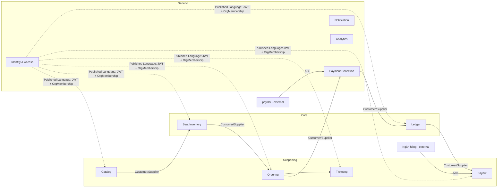

# DDD chiến lược — Subdomain, Bounded Context, Context Map

Trả lời ba câu hỏi trước khi chia service: **đâu là chỗ đáng đầu tư nhất**, **ranh giới ngôn ngữ nằm ở đâu**, và **các context nói chuyện với nhau theo quan hệ gì**.

Sai lầm phổ biến nhất khi làm microservices là chia theo bảng dữ liệu hoặc theo tầng kỹ thuật. Ở đây chia theo **ranh giới ngôn ngữ**: hai chỗ dùng cùng một từ nhưng hiểu khác nhau thì đó là hai context.

---

## 1. Phân loại subdomain

| Subdomain | Loại | Vì sao | Chiến lược |
| --- | --- | --- | --- |
| **Seat Inventory & Reservation** | **Core** | Không oversell ở 10k đồng thời là thứ khách trả tiền để có. Không mua được ngoài thị trường | Đội mạnh nhất, test kỹ nhất, tự viết 100% |
| **Custodial Funds & Settlement** | **Core** | Từ khi nền tảng giữ tiền, độ chính xác sổ sách trở thành sống còn — sai một bút toán là sai tiền thật | Đội mạnh, review 2 người, không được cắt scope |
| Catalog & Seat-map authoring | Supporting | Cần thiết nhưng không khác biệt | Tự viết, giữ đơn giản (grid + CSV) |
| Ordering | Supporting | Điều phối, ít logic riêng | Tự viết, mỏng — chủ yếu là saga orchestrator |
| Ticketing & Check-in | Supporting | Quan trọng nhưng đơn giản về nghiệp vụ | Tự viết |
| Payout Operations | Supporting | Quy trình chi trả, phê duyệt | Tự viết mỏng, dựa trên Ledger |
| Identity & Access | **Generic** | Ai cũng cần, đã có chuẩn | Keycloak (OIDC) + service mỏng cho org/membership |
| Payment Gateway Integration | **Generic** | payOS lo phần khó | ACL bọc payOS, không để chi tiết payOS rò vào domain (ADR-0016) |
| Notification | Generic | Email/SMS | Provider ngoài + service mỏng |
| Analytics | Generic | | Sink + pipeline |

**Hệ quả phân bổ nguồn lực:** hai Core chiếm ~55% công sức backend. Nếu tiến độ căng thì cắt Catalog/Notification/Analytics, **không bao giờ** cắt Inventory hay Ledger.

## 2. Bounded contexts

### Bảng quan hệ

| Upstream | Downstream | Quan hệ | Ghi chú |
| --- | --- | --- | --- |
| Identity | tất cả | **Open Host Service + Published Language** | JWT + `OrganizationMembership` là hợp đồng công khai, ổn định |
| Catalog | Inventory | **Customer/Supplier** | Publish event ⇒ Inventory materialize ghế. Inventory là khách hàng, có quyền yêu cầu contract |
| Inventory | Ordering | **Customer/Supplier + ACL** | Ordering dịch `Reservation` của Inventory thành `OrderItem` của mình |
| Ordering | Payment | Customer/Supplier | Ordering yêu cầu thu tiền, không biết payOS là gì |
| Payment | Ledger | Customer/Supplier | Payment báo "tiền đã vào", Ledger quyết định ghi sổ thế nào |
| Ledger | Payout | Customer/Supplier | Payout hỏi số dư khả dụng, Ledger là nguồn chân lý |
| **payOS** | Payment | **Anti-Corruption Layer** | Bên ngoài, ta không kiểm soát. Payload payOS **không được** xuất hiện quá `infrastructure/payos` |
| **Ngân hàng** | Payout | **Anti-Corruption Layer** | Chi trả có thể thủ công (MVP) hoặc API |
| tất cả | Analytics | **Conformist** | Analytics chấp nhận event như nó vốn có, không đòi upstream đổi |

**Không có Shared Kernel.** Cám dỗ lớn nhất là tạo một thư viện `common-domain` chứa `Money`, `OrganizationId`, `SeatLabel` dùng chung. Chỉ cho phép chia sẻ **value object thuần tuý kỹ thuật, bất biến, không có nghiệp vụ** (`Money`, `TenantId`, `CorrelationId`) trong `packages/shared-kernel` — và mọi thay đổi ở đó phải được cả các đội đồng ý. Mọi khái niệm có nghiệp vụ (`Order`, `Seat`, `Ticket`) **bị cấm** dùng chung.

## 3. Cùng một từ, khác nghĩa — ranh giới thật nằm ở đây

Đây là bằng chứng cho thấy các ranh giới trên là đúng chứ không tuỳ tiện.

| Từ | Trong Catalog | Trong Inventory | Trong Ordering | Trong Ticketing | Trong Ledger |
| --- | --- | --- | --- | --- | --- |
| **Seat** | Ghế áp cứng của địa điểm **hoặc** ghế do tổ chức kê cho một sự kiện | Một đơn vị tồn kho có trạng thái, thuộc một suất diễn | Một dòng hàng có giá đã chốt | Không tồn tại — chỉ còn nhãn ghế in trên vé | Không tồn tại |
| **Event** | Aggregate trung tâm: tiêu đề, mô tả, ảnh, suất diễn | Chỉ là khoá phân vùng tồn kho | Chỉ là ngữ cảnh hiển thị | Nội dung in trên vé | Chiều phân tích doanh thu |
| **Order** | Không tồn tại | Không tồn tại (chỉ biết `reservationId`) | Aggregate trung tâm | Nguồn phát sinh vé | Chứng từ gốc của bút toán |
| **Payment** | — | — | Trạng thái đơn | — | Sự kiện làm phát sinh bút toán |
| **Organization** | Chủ sở hữu sự kiện | Khoá tenant | Người bán | Bên soát vé | **Chủ tài khoản công nợ phải trả** |
| **Money** | Giá niêm yết | — | Giá đã chốt (snapshot) | — | Số dư nợ/có trên tài khoản |

Ví dụ đọc bảng: nếu `Seat` có cùng một nghĩa ở cả 5 cột thì Inventory và Catalog nên là một. Nhưng "ô trên sơ đồ" (sống nhiều năm, dùng lại cho nhiều sự kiện) và "đơn vị tồn kho của một suất" (sống vài tuần, có trạng thái tranh chấp) là hai vòng đời khác nhau — tách là đúng.

## 4. Ubiquitous language — thuật ngữ chốt

Đội Việt Nam, tài liệu tiếng Việt, code tiếng Anh. Bảng này là hợp đồng: **code phải dùng đúng cột "Code", trao đổi phải dùng đúng cột "Tiếng Việt"**. Không được dịch tự do.

### Inventory

| Tiếng Việt | Code | Định nghĩa chính xác |
| --- | --- | --- |
| Giữ ghế | `SeatHold` | Quyền tạm thời trên 1..N ghế, TTL 5 phút, chưa có nghĩa vụ trả tiền |
| Đặt chỗ | `SeatReservation` | Quyền đã gắn với một đơn hàng, giữ 15 phút, ghế ở `RESERVED` |
| Suất diễn | `EventSession` | Một lần diễn có sơ đồ ghế riêng |
| Ghế của suất | `SessionSeat` | Bản sao ghế theo suất, có trạng thái |
| Phiên bản khả dụng | `AvailabilityVersion` | Bộ đếm tăng đơn điệu **cấp suất diễn** để client phát hiện mất gói tin |

### Catalog — thuật ngữ mới của địa điểm dùng chung

| Tiếng Việt | Code | Định nghĩa chính xác |
| --- | --- | --- |
| Địa điểm | `Venue` | Một không gian tổ chức được. `scope = PLATFORM` (superadmin sở hữu, dùng chung) hoặc `ORGANIZATION` (tổ chức tự tạo, riêng) |
| Phiên bản mặt bằng | `VenueLayoutVersion` | Ảnh chụp kết cấu địa điểm; sự kiện **ghim** một version |
| Khu vực | `VenueZone` | Một phần của địa điểm. `kind = FIXED` \| `FLEXIBLE` |
| Ghế áp cứng | `VenueFixedSeat` | Ghế thuộc zone `FIXED`. **Tổ chức không sửa được** |
| Khu vực linh hoạt | zone `kind = FLEXIBLE` | Không gian trống có `max_capacity`; tổ chức tự kê ghế theo từng sự kiện |
| Hình thức vào chỗ | `AdmissionType` | `SEATED` (ghế đánh số) \| `STANDING` (vé đứng, chỉ đếm số lượng) |
| Đơn vị vé đứng | đơn vị ảo `{zone}-GA-000137` | Một chỗ đứng = một hàng `session_seats` = một vé QR; không hiện trên sơ đồ |
| Trùng lịch địa điểm | `VenueScheduleConflict` | Hai suất diễn giao khung giờ tại cùng địa điểm dùng chung — **cảnh báo, không chặn** |
| Thiết kế chỗ ngồi | `EventSeatingPlan` | Cách tổ chức bố trí chỗ cho **một suất diễn** |
| Khối ghế | `EventFlexibleBlock` | Một cụm hàng ghế tham số hoá (số hàng × số ghế/hàng) trong zone linh hoạt |
| Ghi đè ghế | `EventSeatOverride` | `REMOVE` (lối đi) \| `BLOCK` (giữ chỗ) \| `SET_TIER` |
| Mã ghế | `SeatCode` | `{zone}-{section}-{row}-{seat}` — khoá định danh ghế trong một suất |
| Mẫu thiết kế | `SeatingPlanTemplate` | Cấu hình lưu lại để tái sử dụng |

### Finance — thuật ngữ mới của v2

| Tiếng Việt | Code | Định nghĩa chính xác |
| --- | --- | --- |
| Tài khoản ký quỹ | `EscrowAccount` | Tài khoản ngân hàng của NexaTicket nhận tiền khách |
| Bút toán | `JournalEntry` | Một nghiệp vụ kế toán, gồm ≥ 2 định khoản, **luôn cân** |
| Định khoản | `Posting` | Một dòng nợ **hoặc** có trên một tài khoản. Bất biến |
| Công nợ phải trả tổ chức | `OrganizerPayable` | Số tiền NexaTicket đang nợ tổ chức |
| Số dư khả dụng | `AvailableBalance` | Công nợ − đang chi trả − dự phòng hoàn tiền |
| Kỳ giữ tiền | `HoldPeriod` | Thời gian sau khi sự kiện kết thúc mới cho rút |
| Dự phòng hoàn tiền | `RefundReserve` | Phần bị giữ lại phòng khách đòi hoàn |
| Chi trả | `Payout` | Chuyển tiền từ ký quỹ về tài khoản tổ chức |
| Tài khoản treo | `SuspenseAccount` | Nơi ghi tiền đã nhận nhưng chưa xác định được chủ |
| Đối soát | `Reconciliation` | So sao kê ngân hàng với sổ cái |
| Bảng kê thanh toán | `SettlementReport` | Báo cáo sinh từ sổ cái, superadmin gửi tổ chức theo kỳ — kênh đối chiếu duy nhất của tổ chức |
| Doanh thu đã bán | `GrossSales` | Số tiền của vé đã phát hành từ đơn `PAID`, trừ vé đã hoàn — **một trong hai con số tổ chức được thấy** |
| Bút toán đảo | `ReversingEntry` | Cách duy nhất để sửa một bút toán sai |
| Hoa hồng nền tảng | `PlatformCommission` | Phần NexaTicket giữ lại từ mỗi vé bán |

**Từ bị cấm dùng:** "ví" (`wallet`) — gợi ý một sản phẩm cần giấy phép khác; dùng `OrganizerPayable`. "Số dư của tổ chức" nếu không nói rõ là *khả dụng* hay *tổng công nợ* — hai con số này khác nhau và nhầm lẫn giữa chúng là nguồn lỗi tài chính phổ biến nhất.

### Identity

| Tiếng Việt | Code | Định nghĩa |
| --- | --- | --- |
| Tổ chức | `Organization` | Tenant. **Chỉ `SUPER_ADMIN` tạo được.** Một người có thể là thành viên của nhiều tổ chức |
| Thành viên | `Membership` | Liên kết (user, organization, role) |
| Nhân viên soát vé | `CheckinStaff` | Membership có role `CHECKIN_STAFF` |
| Hồ sơ pháp nhân | `OrganizationProfile` | Dữ liệu superadmin nhập khi tạo tổ chức; phục vụ tuân thủ và đối soát, **không** phải cổng kiểm soát tự động |
| Siêu quản trị | `SUPER_ADMIN` | Vai trò nền tảng: tạo/khoá tổ chức, toàn quyền trên tiền |

## 5. Yêu cầu ánh xạ vào context nào

| Yêu cầu | Context chịu trách nhiệm | Điểm thiết kế |
| --- | --- | --- |
| Superadmin tạo ra các tổ chức | **Identity** | `POST /v1/platform/organizations` chỉ `SUPER_ADMIN`. Org tạo ra ở `ACTIVE` + lời mời `ORG_OWNER`. Không có endpoint tự tạo |
| Tổ chức tạo sự kiện, sắp ghế, chọn địa điểm | **Catalog** | Địa điểm dùng chung do superadmin sở hữu; tổ chức tạo `EventSeatingPlan` cho từng suất ([venue-seating-model](venue-seating-model.md)) |
| Một địa chỉ, tổ chức tự thiết kế khu vực ghế | **Catalog** | Zone `FLEXIBLE` — tổ chức kê khối ghế tham số hoá trong `max_capacity` |
| Concert ngồi / hỗn hợp / chỉ đứng | **Catalog** + **Inventory** | `kind` × `admission_type`; vé đứng dùng đơn vị ảo cấp phát bằng `SKIP LOCKED` ([ADR-1012](adr/ADR-1012-standing-admission-inventory.md)) |
| Không biết tổ chức nào thuê địa điểm | **Catalog** | Phát hiện giao khung giờ → cảnh báo cho tổ chức + hàng đợi cho superadmin ([ADR-1013](adr/ADR-1013-venue-schedule-conflict-warning.md)) |
| Khu vực ghế áp cứng không đổi được | **Catalog** | Zone `FIXED` + `VenueFixedSeat` chỉ superadmin sửa; tổ chức chỉ được bật/tắt, chặn, gán hạng vé |
| Tổ chức thêm nhân viên soát vé | **Identity** (cấp quyền) + **Ticketing** (thực thi) | Mời qua email, hoặc mã truy cập theo suất diễn ([ADR-1008](adr/ADR-1008-scanner-access-codes.md)). Ticketing kiểm `organizationId` của vé |
| Superadmin quản lý toàn bộ tiền | **Ledger** + Payment + Payout | Sổ cái kép; VietQR trỏ về TK ký quỹ nền tảng; hoa hồng tách ngay lúc ghi nhận; chi trả do superadmin khởi tạo |
| Tổ chức chỉ biết số tiền và số vé đã bán | **Ticketing** + **Ordering** (báo cáo) | `GET /v1/organizations/{id}/sales-summary` trả đúng hai con số. Không endpoint sổ cái nào mở cho tổ chức |

### Đường ranh quan trọng nhất

**Tổ chức không chạm vào tiền.** Ranh giới này là ranh giới bảo mật, không chỉ là ranh giới tính năng — ba service `payment`, `ledger`, `payout` gộp thành deployable `finance`, tách mạng và tách quyền.

Cái giá phải trả và phải chuẩn bị: tổ chức không tự kiểm chứng được số tiền thực nhận, nên **bảng kê thanh toán sinh từ sổ cái** là bắt buộc, không phải tuỳ chọn. Xem [ADR-1010](adr/ADR-1010-superadmin-tenancy-and-finance-visibility.md) — hệ quả #2.
