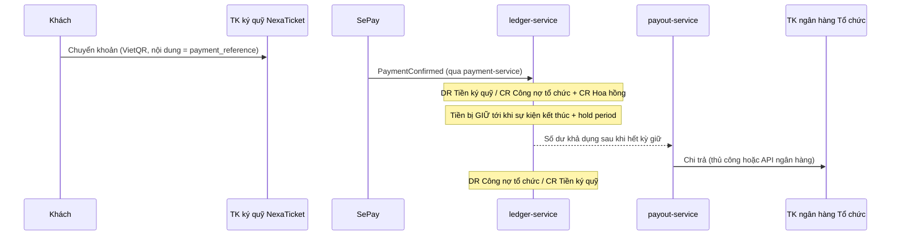

# Mô hình giữ tiền (Custodial funds)

Thay thế `docs/00-discovery/legal-constraints-vn.md §3` và ADR-0013.

**Thay đổi cốt lõi:** khách chuyển tiền vào **tài khoản ký quỹ của NexaTicket**. NexaTicket giữ tiền, ghi nhận công nợ phải trả cho tổ chức, và chi trả sau khi sự kiện kết thúc.

Điều này biến NexaTicket từ phần mềm bán vé thành **hệ thống tài chính**. Tài liệu này thiết kế phần tài chính đó.

---

## 1. Dòng tiền



So sánh với v1:

| | v1 | v2 |
| --- | --- | --- |
| VietQR trỏ về | TK của tổ chức | **TK ký quỹ NexaTicket** |
| Ai giữ tiền tới ngày diễn | Tổ chức | **NexaTicket** |
| `bank_accounts` của tổ chức | Nơi **nhận** tiền khách | Nơi **nhận chi trả** |
| Ai chịu rủi ro khách đòi hoàn tiền | Tổ chức | **NexaTicket** (rồi truy đòi tổ chức) |
| Ai cần giấy phép | Không ai | **NexaTicket** — xem §9 |
| Hoa hồng nền tảng | Thu ngoài, khó cưỡng chế | **Tự động khấu trừ khi ghi nhận** |

Lợi ích thật của mô hình mới: thu hoa hồng chắc chắn, kiểm soát được hoàn tiền, và chặn được kịch bản tổ chức bán vé rồi biến mất. Cái giá là toàn bộ phần còn lại của tài liệu này.

---

## 2. Hệ thống tài khoản (Chart of Accounts)

Kế toán kép. Mọi bút toán có **tổng Nợ = tổng Có**.

| Mã | Tên | Loại | Số dư thường | Chủ sở hữu |
| --- | --- | --- | --- | --- |
| `1010` | Tiền — TK ký quỹ | Tài sản | Nợ | Nền tảng |
| `1020` | Tiền — TK vận hành | Tài sản | Nợ | Nền tảng |
| `1320` | Phải thu tổ chức | Tài sản | Nợ | Từng tổ chức |
| `2011` | Phải trả tổ chức — **đang giữ** | Nợ phải trả | Có | Từng tổ chức |
| `2012` | Phải trả tổ chức — **khả dụng** | Nợ phải trả | Có | Từng tổ chức |
| `2013` | Dự phòng hoàn tiền | Nợ phải trả | Có | Từng tổ chức |
| `2020` | Phải trả hoàn tiền khách | Nợ phải trả | Có | Từng đơn hàng |
| `2030` | **Tài khoản treo** — tiền chưa xác định chủ | Nợ phải trả | Có | Nền tảng |
| `2040` | Chi trả đang thực hiện | Nợ phải trả | Có | Từng tổ chức |
| `4010` | Doanh thu hoa hồng | Doanh thu | Có | Nền tảng |
| `5010` | Chi phí cổng thanh toán | Chi phí | Nợ | Nền tảng |
| `5020` | Phí chuyển khoản chi trả | Chi phí | Nợ | Nền tảng |

### Vì sao tách `2011` (đang giữ) và `2012` (khả dụng)

Đây là quyết định thiết kế quan trọng nhất của sổ cái. Nếu chỉ có một tài khoản "phải trả tổ chức" thì "số dư khả dụng" phải tính bằng công thức rải trong code — và công thức đó sẽ sai ở đâu đó.

Tách ra thì **số dư khả dụng chính là số dư tài khoản `2012`**. Không công thức, không suy diễn, tra sổ là biết. Việc chuyển từ giữ sang khả dụng trở thành một bút toán có thời điểm, có người ghi, có thể kiểm toán.

### Vì sao cần `2030` — tài khoản treo

Runbook v1 đặt mục tiêu *"không có transaction vô chủ"*. Với sổ cái, mục tiêu đó có định nghĩa chính xác: **mọi đồng tiền vào tài khoản ngân hàng đều phải có bút toán**. Tiền không khớp được đơn nào vẫn phải ghi — vào `2030` — rồi mới xử lý. Không được để nó "chưa ghi sổ".

---

## 3. Bút toán cho từng nghiệp vụ

Ví dụ: đơn 3.000.000 ₫, hoa hồng 5% = 150.000 ₫.

### N1 — Khách chuyển khoản thành công (`PaymentConfirmed`)

| Tài khoản | Nợ | Có |
| --- | ---: | ---: |
| `1010` Tiền ký quỹ | 3.000.000 | |
| `2011` Phải trả tổ chức — đang giữ | | 2.850.000 |
| `4010` Doanh thu hoa hồng | | 150.000 |

Hoa hồng ghi nhận **ngay lúc bán**, không đợi chi trả. Tỷ lệ lấy từ snapshot trong `order_items` (đổi biểu phí sau không làm sai sổ cũ).

### N2 — Tiền vào không khớp đơn nào (`PaymentUnmatched`)

| Tài khoản | Nợ | Có |
| --- | ---: | ---: |
| `1010` Tiền ký quỹ | 500.000 | |
| `2030` Tài khoản treo | | 500.000 |

Sau khi tra ra chủ (`PaymentResolved` → khớp đơn):

| Tài khoản | Nợ | Có |
| --- | ---: | ---: |
| `2030` Tài khoản treo | 500.000 | |
| `2011` Phải trả tổ chức | | 475.000 |
| `4010` Hoa hồng | | 25.000 |

Hoặc trả lại người gửi:

| Tài khoản | Nợ | Có |
| --- | ---: | ---: |
| `2030` Tài khoản treo | 500.000 | |
| `1010` Tiền ký quỹ | | 500.000 |

### N3 — Hết kỳ giữ tiền (sự kiện kết thúc + hold period)

Dự phòng hoàn tiền 5%:

| Tài khoản | Nợ | Có |
| --- | ---: | ---: |
| `2011` Đang giữ | 2.850.000 | |
| `2012` Khả dụng | | 2.707.500 |
| `2013` Dự phòng hoàn tiền | | 142.500 |

Hết kỳ dự phòng (+30 ngày):

| Tài khoản | Nợ | Có |
| --- | ---: | ---: |
| `2013` Dự phòng | 142.500 | |
| `2012` Khả dụng | | 142.500 |

### N4 — Hoàn tiền cho khách, tiền còn đang giữ

Chính sách mặc định: **trả lại khách toàn bộ, nền tảng hoàn cả hoa hồng.**

| Tài khoản | Nợ | Có |
| --- | ---: | ---: |
| `2011` Đang giữ | 2.850.000 | |
| `4010` Hoa hồng (đảo) | 150.000 | |
| `2020` Phải trả hoàn tiền khách | | 3.000.000 |

Khi đã chuyển tiền về cho khách:

| Tài khoản | Nợ | Có |
| --- | ---: | ---: |
| `2020` Phải trả hoàn tiền | 3.000.000 | |
| `1010` Tiền ký quỹ | | 3.000.000 |

> **Biến thể theo chính sách:** nếu nền tảng giữ lại hoa hồng khi hoàn tiền, thay dòng `4010` bằng `2011` thêm 150.000 (tổ chức chịu toàn bộ). Cấu hình ở cấp hợp đồng với tổ chức, snapshot vào đơn.

### N5 — Hoàn tiền khi đã chi trả cho tổ chức

Trường hợp xấu nhất, và là lý do `2013` tồn tại. Ưu tiên trừ vào dự phòng, thiếu thì trừ khả dụng, vẫn thiếu thì ghi phải thu:

| Tài khoản | Nợ | Có |
| --- | ---: | ---: |
| `2013` Dự phòng hoàn tiền | 142.500 | |
| `2012` Khả dụng | 500.000 | |
| `1320` **Phải thu tổ chức** | 2.357.500 | |
| `2020` Phải trả hoàn tiền khách | | 3.000.000 |

`1320` là khoản tổ chức nợ nền tảng — thu hồi bằng cách trừ vào doanh thu sự kiện sau, hoặc đòi ngoài hệ thống. Số dư `1320` > 0 phải sinh alert: đây là tiền nền tảng đang mất.

### N6 — Chi trả cho tổ chức

Yêu cầu rút 10.000.000, phí chuyển khoản 11.000 do tổ chức chịu:

| Tài khoản | Nợ | Có |
| --- | ---: | ---: |
| `2012` Khả dụng | 10.000.000 | |
| `2040` Chi trả đang thực hiện | | 9.989.000 |
| `4010` (hoặc `5020` nếu nền tảng chịu) | | 11.000 |

Ngân hàng xác nhận đã chuyển:

| Tài khoản | Nợ | Có |
| --- | ---: | ---: |
| `2040` Chi trả đang thực hiện | 9.989.000 | |
| `1010` Tiền ký quỹ | | 9.989.000 |

Chuyển khoản thất bại → **bút toán đảo** của bút toán đầu, không sửa bút toán cũ.

### N7 — Phí SePay

| Tài khoản | Nợ | Có |
| --- | ---: | ---: |
| `5010` Chi phí cổng thanh toán | 5.000 | |
| `1010` Tiền ký quỹ | | 5.000 |

---

## 4. Lược đồ dữ liệu

```sql
ledger_accounts (
  id             UUID PRIMARY KEY,
  code           TEXT NOT NULL,                     -- '2011'
  name           TEXT NOT NULL,
  account_type   TEXT NOT NULL,                     -- ASSET|LIABILITY|EQUITY|REVENUE|EXPENSE
  normal_balance TEXT NOT NULL,                     -- DEBIT|CREDIT
  owner_type     TEXT NOT NULL,                     -- PLATFORM|ORGANIZATION|ORDER
  owner_id       UUID,                              -- NULL khi owner_type='PLATFORM'
  currency       CHAR(3) NOT NULL DEFAULT 'VND',
  status         TEXT NOT NULL DEFAULT 'ACTIVE',
  created_at     TIMESTAMPTZ NOT NULL,
  UNIQUE (code, owner_type, owner_id)
);

journal_entries (
  id               UUID PRIMARY KEY,
  seq              BIGSERIAL UNIQUE NOT NULL,       -- thứ tự ghi sổ toàn cục
  entry_type       TEXT NOT NULL,                   -- PAYMENT_CONFIRMED | HOLD_RELEASED | ...
  occurred_at      TIMESTAMPTZ NOT NULL,            -- thời điểm nghiệp vụ xảy ra
  recorded_at      TIMESTAMPTZ NOT NULL,            -- thời điểm ghi sổ
  source_type      TEXT NOT NULL,                   -- ORDER|PAYMENT|PAYOUT|ADJUSTMENT
  source_id        UUID NOT NULL,
  organization_id  UUID,
  correlation_id   TEXT,
  idempotency_key  TEXT NOT NULL UNIQUE,            -- chống ghi trùng khi consumer retry
  memo             TEXT,
  reverses_entry_id UUID REFERENCES journal_entries(id),
  created_by       TEXT NOT NULL                    -- tên service hoặc actor
);

postings (
  id         UUID PRIMARY KEY,
  entry_id   UUID NOT NULL REFERENCES journal_entries(id),
  account_id UUID NOT NULL REFERENCES ledger_accounts(id),
  direction  TEXT   NOT NULL CHECK (direction IN ('DEBIT','CREDIT')),
  amount_vnd BIGINT NOT NULL CHECK (amount_vnd > 0),
  line_no    INT    NOT NULL,
  UNIQUE (entry_id, line_no)
);
```

### Ép cân bằng ở tầng database

Không tin vào application code cho việc này:

```sql
CREATE FUNCTION assert_entry_balanced() RETURNS TRIGGER AS $$
DECLARE d BIGINT; c BIGINT;
BEGIN
  SELECT COALESCE(SUM(amount_vnd) FILTER (WHERE direction='DEBIT'), 0),
         COALESCE(SUM(amount_vnd) FILTER (WHERE direction='CREDIT'), 0)
    INTO d, c FROM postings WHERE entry_id = NEW.entry_id;
  IF d <> c THEN
    RAISE EXCEPTION 'Bút toán % không cân: Nợ=% Có=%', NEW.entry_id, d, c;
  END IF;
  RETURN NULL;
END $$ LANGUAGE plpgsql;

CREATE CONSTRAINT TRIGGER trg_entry_balanced
  AFTER INSERT ON postings
  DEFERRABLE INITIALLY DEFERRED
  FOR EACH ROW EXECUTE FUNCTION assert_entry_balanced();
```

`DEFERRABLE INITIALLY DEFERRED` cho phép chèn từng dòng rồi kiểm tra lúc commit. Bút toán lệch **không thể** vào được database.

### Quyền truy cập

```sql
REVOKE UPDATE, DELETE ON postings, journal_entries FROM app_ledger;
GRANT  INSERT, SELECT  ON postings, journal_entries TO   app_ledger;
```

Sổ cái là append-only **ở cấp quyền database**, không chỉ ở cấp quy ước. Kể cả bug trong application cũng không xoá được lịch sử.

### Tính số dư — không dùng hot row

```sql
account_balance_snapshots (
  account_id UUID NOT NULL,
  as_of_seq  BIGINT NOT NULL,
  balance_vnd BIGINT NOT NULL,
  computed_at TIMESTAMPTZ NOT NULL,
  PRIMARY KEY (account_id, as_of_seq)
);
```

```
balance(account) = snapshot mới nhất
                 + Σ postings có entry.seq > snapshot.as_of_seq  (dấu theo normal_balance)
```

Job snapshot chạy mỗi 5 phút. Cách này tránh hoàn toàn việc `UPDATE` một hàng số dư — thứ sẽ thành điểm nghẽn khi 10k người mua vé cùng một tổ chức, và tệ hơn, thành nguồn sai số nếu có bug.

---

## 5. Bất biến — kiểm tra tự động, có alert

| # | Bất biến | Cách kiểm | Tần suất |
| --- | --- | --- | --- |
| 1 | Mọi bút toán cân | Constraint trigger | Mọi lần ghi |
| 2 | Không có `UPDATE`/`DELETE` trên `postings` | Quyền DB + audit log của Postgres | Liên tục |
| 3 | Bảng cân đối thử: Σ Nợ = Σ Có toàn hệ thống | Job | Hằng ngày |
| 4 | `balance(1010)` = số dư thật của TK ngân hàng | Đối soát sao kê | Hằng ngày |
| 5 | `balance(2012)` ≥ 0 với mọi tổ chức | Job | Mỗi giờ |
| 6 | Σ (`2011`+`2012`+`2013`+`2020`+`2030`+`2040`) ≤ `balance(1010)` | Job — **tiền hứa trả không được nhiều hơn tiền đang có** | Mỗi giờ |
| 7 | `balance(1320)` = 0 | Job — khác 0 nghĩa là đang mất tiền | Hằng ngày |
| 8 | Mọi giao dịch trong sao kê có bút toán tương ứng | Đối soát | Hằng ngày |

**Bất biến #6 là quan trọng nhất.** Nó phát hiện tình trạng vỡ quỹ: nếu tổng nghĩa vụ phải trả vượt tiền thực có, hệ thống đang hứa nhiều hơn khả năng. Vi phạm phải là **cảnh báo mức cao nhất**, dừng chi trả tự động ngay lập tức.

---

## 6. Đối soát ngân hàng hằng ngày

```
1. Nhập sao kê TK ký quỹ (CSV/API ngân hàng) → bảng bank_statement_lines
2. Khớp từng dòng với journal_entries theo (số tiền, ngày, nội dung/reference)
3. Phân loại:
   - Khớp                      → đánh dấu RECONCILED
   - Có ở ngân hàng, không sổ  → tiền vào chưa ghi sổ → ghi vào 2030, mở case
   - Có ở sổ, không ngân hàng  → NGHIÊM TRỌNG, điều tra ngay
   - Lệch số tiền              → mở case
4. Xuất báo cáo đối soát; ngày nào chưa đóng thì không được chi trả
```

Quy tắc vận hành: **ngày nào chưa đối soát xong thì payout của ngày đó bị khoá.** Không chi trả trên số liệu chưa được xác nhận với ngân hàng.

---

## 7. Kỳ giữ tiền, dự phòng và chi trả

### Kỳ giữ tiền (Hold period)

```
Tiền vào (2011 đang giữ)
   → sự kiện kết thúc (event_session.ends_at)
   → + hold period (mặc định 3 ngày làm việc)
   → chuyển sang 2012 khả dụng (trừ dự phòng)
```

Vì sao phải giữ tới sau sự kiện: nếu chi trả trước ngày diễn mà sự kiện bị huỷ, nền tảng phải hoàn tiền cho hàng nghìn khách bằng tiền của chính mình. Đây không phải rủi ro lý thuyết — huỷ sự kiện là chuyện thường xuyên.

| Tham số | Mặc định | Cấu hình theo |
| --- | --- | --- |
| Hold period | 3 ngày làm việc sau `ends_at` | Từng tổ chức |
| Dự phòng hoàn tiền | 5% | Từng tổ chức, theo lịch sử |
| Kỳ giữ dự phòng | 30 ngày | Toàn nền tảng |
| Chi trả sớm | Không cho phép MVP | — |

Tổ chức có lịch sử tốt (≥ 5 sự kiện, tỷ lệ hoàn tiền < 1%) có thể hạ dự phòng xuống 0% và hold period còn 1 ngày. Tổ chức mới giữ mặc định.

### Cổng chặn chi trả

Chi trả do **`SUPER_ADMIN` khởi tạo** — tổ chức không có quyền yêu cầu rút tiền ([ADR-1010](adr/ADR-1010-superadmin-tenancy-and-finance-visibility.md)).

```
1. Sự kiện đã kết thúc + hold period?     không → HOLD_PERIOD_NOT_ELAPSED
2. Số dư 2012 ≥ số tiền chi?              không → INSUFFICIENT_BALANCE
3. Đối soát ngân hàng hôm trước đã đóng?  không → RECONCILIATION_PENDING
4. Tổ chức không bị SUSPENDED?            không → ORGANIZATION_SUSPENDED
5. balance(1320) phải thu = 0?            không → OUTSTANDING_RECEIVABLE
6. Tên chủ TK khớp hồ sơ pháp nhân?       không → PAYOUT_ACCOUNT_NAME_MISMATCH
```

Cổng `KYC_REQUIRED` đã được gỡ: superadmin thẩm định tổ chức **trước khi tạo**, nên cổng đó giờ là con người chứ không phải phần mềm.

MVP: chi trả **thủ công có phê duyệt** — payout-service tạo lô, người vận hành chuyển khoản qua ngân hàng, rồi xác nhận vào hệ thống. Tự động hoá bằng API ngân hàng chỉ làm sau khi quy trình thủ công đã chạy ổn định vài tháng. Chuyển tiền tự động là nơi một con bug tốn tiền thật.

**Nguyên tắc bốn mắt:** lô chi trả trên một ngưỡng (ví dụ 100 triệu) cần hai người phê duyệt khác nhau. Người tạo lô không được là người duyệt.

---

## 8. Thẩm định tổ chức và phạm vi tổ chức nhìn thấy

### Thẩm định diễn ra trước khi tạo, ngoài phần mềm

Vì chỉ `SUPER_ADMIN` tạo được tổ chức ([ADR-1010](adr/ADR-1010-superadmin-tenancy-and-finance-visibility.md)), việc thẩm định là thao tác của con người **trước** khi bấm tạo. Phần mềm không còn máy trạng thái KYC; `organizations.status` chỉ có `ACTIVE` | `SUSPENDED`.

Hồ sơ superadmin nhập vào `organization_profiles` khi tạo, phục vụ tuân thủ và đối soát:

| Loại tổ chức | Cần lưu |
| --- | --- |
| Doanh nghiệp | GPKD, MST, người đại diện, TK ngân hàng **đứng tên công ty** |
| Cá nhân | CCCD, TK ngân hàng **đứng tên chính chủ** |

Quy tắc cứng vẫn giữ và vẫn ép ở tầng hệ thống: **tên chủ tài khoản nhận chi trả phải khớp tên pháp nhân/cá nhân trong hồ sơ.** Chi trả vào tài khoản đứng tên người khác là dấu hiệu rửa tiền điển hình.

Ngưỡng rủi ro cần rà soát thủ công: tổ chức mới bán > 100 triệu trong 24 giờ đầu; đổi tài khoản nhận trong vòng 7 ngày trước kỳ chi trả; một người đại diện đứng tên nhiều tổ chức.

### Tổ chức nhìn thấy đúng hai con số

| Dữ liệu | Tổ chức | Superadmin |
| --- | :---: | :---: |
| Số vé đã bán | ✅ | ✅ |
| Số tiền đã bán (doanh thu gộp) | ✅ | ✅ |
| Ghế còn trống / đã giữ / đã bán | ✅ *(vận hành)* | ✅ |
| Lượt check-in | ✅ *(vận hành)* | ✅ |
| Hoa hồng nền tảng | ❌ | ✅ |
| Số dư đang giữ / khả dụng / dự phòng | ❌ | ✅ |
| Sao kê sổ cái, bút toán | ❌ | ✅ |
| Tài khoản ký quỹ, tài khoản nhận chi trả | ❌ | ✅ |
| Trạng thái và lịch sử chi trả | ❌ | ✅ |
| Đối soát ngân hàng | ❌ | ✅ |

```
GET /v1/organizations/{id}/sales-summary?eventId&sessionId&from&to
{ "ticketsSold": 1240, "grossSalesVnd": 1860000000, "breakdown": [ … ] }
```

Chỉ tính vé đã phát hành từ đơn `PAID`; vé đã hoàn tiền bị trừ khỏi cả hai con số.

**Nghĩa vụ đi kèm — không được bỏ:** vì tổ chức không tự kiểm chứng được số tiền thực nhận, superadmin phải gửi **bảng kê thanh toán** (`settlement-report`) theo kỳ, sinh **từ sổ cái**, gồm sự kiện, số vé, doanh thu gộp, hoa hồng, số thực nhận. Đây là kênh đối chiếu duy nhất của tổ chức. Không có nó, mỗi kỳ chi trả sẽ sinh ra một loạt email hỏi tiền mà đội vận hành phải trả lời thủ công.

---

## 9. Pháp lý — bắt buộc đọc

**Đây không phải tư vấn pháp lý. Phải có luật sư rà soát trước khi vận hành thật.**

Ở Việt Nam, giữ tiền của bên thứ ba và thanh toán hộ là **hoạt động trung gian thanh toán**, thuộc phạm vi điều chỉnh của pháp luật về thanh toán không dùng tiền mặt (hiện hành: Nghị định 52/2024/NĐ-CP) và cần **giấy phép do Ngân hàng Nhà nước cấp**. Các dịch vụ liên quan gồm ví điện tử, cổng thanh toán, hỗ trợ thu hộ/chi hộ. Điều kiện cấp phép gồm vốn tối thiểu, nhân sự, hạ tầng kỹ thuật và quy trình được thẩm định.

Tài liệu v1 (`legal-constraints-vn.md §3`) được thiết kế **có chủ đích** để tiền đi thẳng vào tài khoản organizer, chính là để tránh vùng cấp phép này. Yêu cầu mới đưa dự án vào vùng đó.

### Ba đường đi

| Phương án | Mô tả | Thời gian | Rủi ro |
| --- | --- | --- | --- |
| **A. Tự xin giấy phép** | NexaTicket trở thành tổ chức cung ứng dịch vụ trung gian thanh toán | 12–24 tháng, vốn lớn | Thấp sau khi có phép; không khả thi cho MVP |
| **B. Hợp tác đơn vị đã có phép** *(khuyến nghị)* | Dùng sản phẩm tài khoản định danh / thu hộ chi hộ của một trung gian thanh toán đã được cấp phép. Tiền nằm ở tài khoản do đối tác quản lý; NexaTicket **điều phối và ghi sổ** | 1–3 tháng | Thấp; phụ thuộc đối tác |
| **C. Tài khoản ký quỹ tại ngân hàng** | Thoả thuận tài khoản ký quỹ/chuyên dùng với ngân hàng, có hợp đồng ba bên | 2–4 tháng | Trung bình; phụ thuộc thẩm định của ngân hàng |

**Khuyến nghị B.** Điểm mấu chốt về mặt kỹ thuật: **thiết kế phần mềm trong tài liệu này không đổi dù chọn phương án nào.** Sổ cái, kỳ giữ tiền, KYC, đối soát, chi trả đều giữ nguyên. Cái thay đổi chỉ là *ai đứng tên tài khoản `1010`* và *ai thực hiện lệnh chuyển tiền ở bước cuối*. Nghĩa là có thể xây ngay theo thiết kế này và chốt pháp lý song song — không bị chặn.

### Nghĩa vụ đi kèm

| Nghĩa vụ | Ghi chú |
| --- | --- |
| Thuế GTGT trên hoa hồng | Doanh thu `4010` chịu VAT; xuất hoá đơn cho tổ chức |
| Hoá đơn cho khách mua vé | Vẫn thuộc tổ chức (v1 giữ nguyên), nhưng nay tiền qua nền tảng nên cần ghi rõ trong điều khoản |
| Chống rửa tiền | Lưu hồ sơ KYC, báo cáo giao dịch đáng ngờ và giao dịch giá trị lớn theo quy định |
| Lưu trữ chứng từ | Sổ cái, sao kê, hồ sơ KYC: tối thiểu 10 năm |
| Tiền ký quỹ **không phải** doanh thu | Chỉ `4010` là doanh thu. Nhầm chỗ này là sai báo cáo tài chính nghiêm trọng |
| Điều khoản với tổ chức | Phải nêu rõ: kỳ giữ tiền, dự phòng, hoa hồng, quyền khấu trừ khi hoàn tiền |

---

## 10. Rủi ro gian lận đã chuyển sang nền tảng

Với v1, tổ chức lừa đảo lấy tiền trực tiếp từ khách — thiệt hại là của khách và tổ chức. Với v2, tiền đi qua tay NexaTicket, nên **NexaTicket chịu trách nhiệm hoàn trả**.

| Kịch bản | Phòng thủ |
| --- | --- |
| Tổ chức bán vé sự kiện không có thật rồi biến mất | **Superadmin gác cổng tạo tổ chức** + hold period tới sau ngày diễn + khớp tên TK nhận |
| Sự kiện bị huỷ sau khi đã chi trả | Không chi trả trước `ends_at`; dự phòng 5% |
| Khách đòi hoàn tiền hàng loạt | Dự phòng + `1320` phải thu + quyền khấu trừ trong hợp đồng |
| Tự mua vé sự kiện của chính mình để rút tiền bẩn | Phát hiện qua trùng thiết bị/tài khoản chuyển; ngưỡng rà soát thủ công |
| Đổi TK nhận ngay trước khi rút | Khoá rút 7 ngày sau khi đổi TK + thông báo email |

Ba phòng thủ mạnh nhất, theo thứ tự: **superadmin gác cổng tạo tổ chức**, **hold period tới sau ngày diễn**, **dự phòng hoàn tiền**. Mô hình superadmin tạo tổ chức làm phòng thủ thứ nhất mạnh hơn hẳn so với tự phục vụ — nhưng đổi lại onboarding không tự động được.

---

## 11. Việc phải làm khi triển khai

- [ ] Chốt phương án pháp lý (§9) — song song, không chặn code
- [ ] Chốt biểu phí hoa hồng và chính sách hoàn hoa hồng khi refund
- [ ] Migration `ledger_db` + constraint trigger cân bằng + quyền append-only
- [ ] Seed chart of accounts; tự tạo bộ tài khoản `2011/2012/2013` khi nhận `OrganizationCreated`
- [ ] Consumer `PaymentConfirmed` → bút toán N1, idempotent theo `paymentAttemptId`
- [ ] Job hết kỳ giữ tiền → bút toán N3
- [ ] Job snapshot số dư 5 phút
- [ ] 8 job kiểm tra bất biến + alert (§5)
- [ ] Nhập sao kê + đối soát hằng ngày (§6)
- [ ] Superadmin tạo tổ chức + nhập hồ sơ pháp nhân (mã hoá tài liệu nhạy cảm)
- [ ] Payout (chỉ superadmin): tạo lệnh → duyệt bốn mắt → lô → xác nhận
- [ ] Sinh `settlement-report` từ sổ cái để gửi tổ chức theo kỳ
- [ ] Màn hình tổ chức: **chỉ** số vé đã bán + số tiền đã bán (+ breakdown theo sự kiện/suất)
- [ ] Màn hình superadmin: tạo/khoá tổ chức, bảng cân đối thử, đối soát, lô chi trả, bảng kê thanh toán
- [ ] Diễn tập: huỷ sự kiện đã bán 500 vé — hoàn tiền toàn bộ, kiểm tra sổ cái vẫn cân
