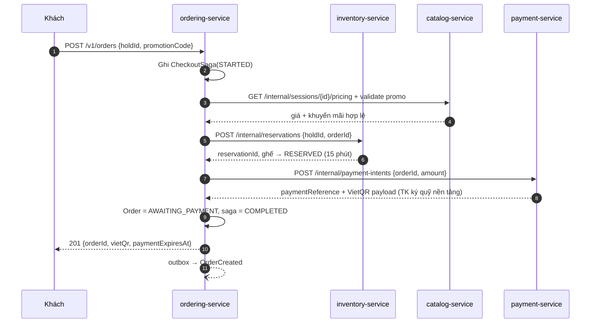
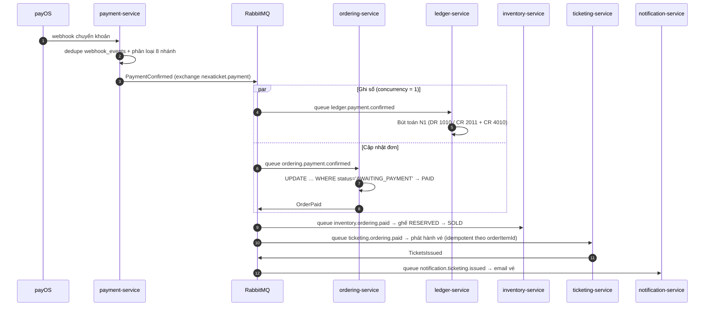
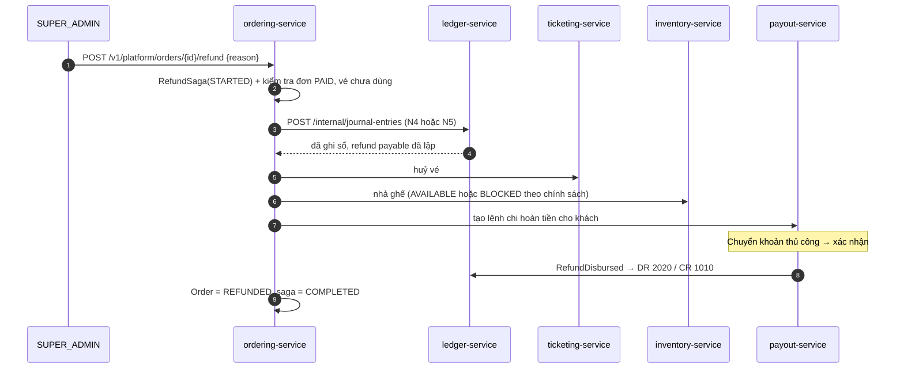
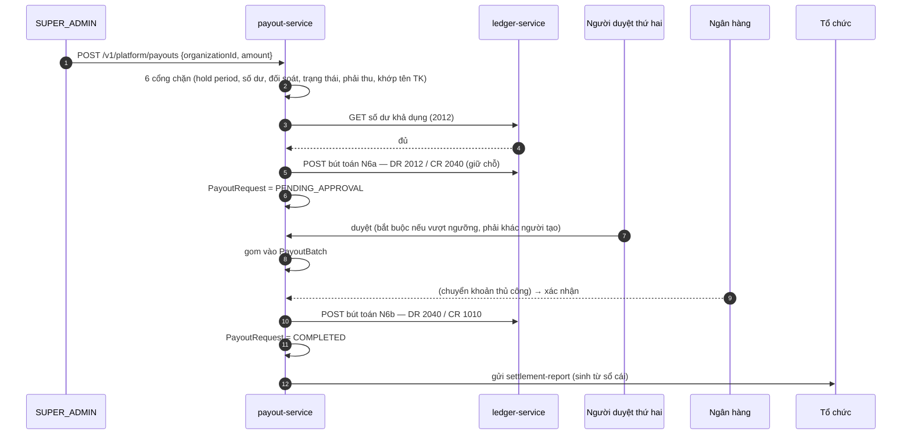

# Saga — Giao dịch phân tán

Ở v1, "tạo đơn hàng" là một transaction PostgreSQL. Ở v2 nó chạm 4 service với 4 database. Tài liệu này định nghĩa từng luồng, bước bù trừ, và cách xử lý khi hỏng giữa chừng.

Vận chuyển bất đồng bộ là **RabbitMQ** ([ADR-1009](adr/ADR-1009-rabbitmq-only.md)). Điều đó có một hệ quả xuyên suốt tài liệu này: **không có bảo đảm thứ tự message**, nên mọi consumer phải cho ra kết quả đúng bất kể thứ tự đến.

---

## 1. Nguyên tắc chọn kiểu saga

| | Orchestration (có nhạc trưởng) | Choreography (tự phối hợp) |
| --- | --- | --- |
| Ai điều phối | Một service giữ state machine | Không ai — mỗi service phản ứng với event |
| Nhìn thấy tiến độ | Dễ — tra một bảng | Khó — phải ghép log nhiều nơi |
| Ghép nối | Chặt hơn | Lỏng hơn |
| Hợp với | Luồng tiền, luồng cần bù trừ | Luồng lan toả, fan-out |

**Quy tắc chốt cho dự án này:**

> Có tiền hoặc có bù trừ ⇒ **orchestration**. Chỉ lan toả thông tin ⇒ **choreography**.

Lý do thực dụng: 3 giờ sáng ngày mở bán, khi một đơn kẹt, người trực cần trả lời được "đơn này đang ở bước nào" bằng **một** câu truy vấn. Choreography không cho ta điều đó.

| Saga | Kiểu | Nhạc trưởng |
| --- | --- | --- |
| Checkout | Orchestration | ordering-service |
| Xác nhận thanh toán | Choreography | — |
| Hoàn tiền | Orchestration | ordering-service |
| Chi trả | Orchestration | payout-service (**superadmin khởi tạo**) |
| Publish sự kiện | Choreography | — |

---

## 2. Saga Checkout — đồng bộ, có bù trừ

Khách đang nhìn màn hình chờ mã QR. Không thể trả "đang xử lý, mời quay lại sau". Vì vậy các bước dùng **HTTP đồng bộ + bù trừ**, không dùng message.



### Bảng bù trừ

| Bước hỏng | Đã làm gì | Bù trừ |
| --- | --- | --- |
| 3 (giá/promo) | Chưa gì | Không cần → trả `PROMOTION_INVALID` |
| 5 (đặt chỗ) | Chưa gì | Không cần → trả `HOLD_EXPIRED` / `SEAT_UNAVAILABLE` |
| 7 (payment intent) | Ghế đã `RESERVED` | `DELETE /internal/reservations/{orderId}` → ghế về `AVAILABLE` |
| 8 (ghi order) | Ghế `RESERVED` + intent | Huỷ intent + huỷ reservation |

**Timeout:** mỗi lời gọi nội bộ 2 giây, không retry ở bước 5 và 7 trong luồng đồng bộ (retry sẽ vượt ngân sách thời gian của người dùng). Hỏng ⇒ bù trừ ngay và trả lỗi.

**Nếu bù trừ cũng hỏng** (inventory không phản hồi khi rollback): ghi `CheckoutSaga(COMPENSATION_PENDING)`, một job quét mỗi 30 giây sẽ bù trừ lại. Và kể cả job cũng hỏng thì `payment_expires_at` 15 phút vẫn nhả ghế. **Ba lớp an toàn**, hạn xấu nhất 15 phút.

### Idempotency xuyên service

`Idempotency-Key` của khách được truyền xuống: `POST /internal/reservations` dùng `orderId` làm khoá idempotent, `POST /internal/payment-intents` cũng vậy. Khách bấm hai lần ⇒ cùng `orderId` ⇒ mọi bước đều nhận ra và trả kết quả cũ, không tạo bản sao.

---

## 3. Saga Xác nhận thanh toán — bất đồng bộ

Khách đã rời đi. Không ai đang chờ. Ở đây eventual consistency là đúng và rẻ.



Nhiều consumer trên cùng một sự kiện = nhiều queue cùng bind vào một topic exchange. Đây là việc RabbitMQ làm tốt.

### Không dựa vào thứ tự — nguyên tắc bắt buộc

RabbitMQ không bảo đảm thứ tự khi có nhiều consumer. Mọi handler phải viết theo kiểu **điều kiện trạng thái**, không phải giả định thứ tự:

```sql
-- Đúng: đến sớm hay muộn đều cho kết quả đúng
UPDATE orders SET status = 'PAID'
 WHERE id = ? AND status = 'AWAITING_PAYMENT';

-- Sai: giả định đơn đang ở đúng trạng thái mong đợi
UPDATE orders SET status = 'PAID' WHERE id = ?;
```

Ví dụ cụ thể phải chịu được: `PaymentConfirmed` và `OrderExpired` của cùng một đơn đến **ngược thứ tự**. Với điều kiện trạng thái, kết quả cuối luôn đúng — worker hết hạn có `WHERE status='AWAITING_PAYMENT'` nên không thể ghi đè một đơn đã `PAID`.

`ledger.*` chạy `concurrency = 1` để bút toán tuần tự và tất định ([ADR-1009 §4](adr/ADR-1009-rabbitmq-only.md)).

### Hệ quả UX phải xử lý ở frontend

Giữa `OrderPaid` và `TicketsIssued` có một khoảng — thường dưới 1 giây, nhưng khi broker trễ có thể vài giây. Màn C-PAY phải có **trạng thái thứ ba**:

| Trạng thái đơn | Vé đã có? | UI |
| --- | --- | --- |
| `AWAITING_PAYMENT` | Không | QR + đếm ngược |
| `PAID` | **Chưa** | "Đã nhận thanh toán — đang phát hành vé…" + spinner |
| `PAID` | Rồi | Chuyển sang màn vé |

Đây là chi phí trực tiếp của microservices mà v1 không có. Không xử lý thì khách thấy "đã thanh toán" nhưng bấm vào Vé của tôi lại trống — và họ sẽ gọi tổng đài.

### Không có bù trừ, chỉ có retry

Không bù trừ được: tiền đã vào tài khoản thật. Mọi consumer phải **retry cho tới khi thành công** qua `nexaticket.retry` (backoff 5s/30s/2m/10m/1h). Hết 5 lần ⇒ DLQ + cảnh báo mức cao nhất + xử lý thủ công. Đơn `PAID` mà không có vé là sự cố nghiêm trọng, không phải lỗi thông thường.

---

## 4. Saga Hoàn tiền — orchestration

Chỉ `SUPER_ADMIN` khởi tạo — tổ chức không có quyền trên tiền.



**Thứ tự cố ý: ghi sổ trước, huỷ vé sau.** Nếu huỷ vé xong mới ghi sổ mà ghi sổ hỏng, khách mất vé nhưng chưa có ghi nhận nợ hoàn tiền — trạng thái tệ nhất có thể. Ghi sổ trước thì tệ nhất là khách còn vé nhưng sổ đã ghi nợ hoàn tiền, và một job đối chiếu sẽ dọn.

| Bước hỏng | Bù trừ |
| --- | --- |
| Ghi sổ | Không có gì để bù → trả lỗi cho superadmin |
| Huỷ vé | Bút toán đảo ở Ledger + saga `FAILED` |
| Nhả ghế | Không bù (ghế bị giữ thừa là vô hại) → job dọn |
| Tạo lệnh chi | Giữ `2020` phải trả hoàn tiền → hàng đợi thủ công |

Vé đã `CHECKED_IN` ⇒ chỉ ghi nhận tài chính, không nhả ghế, không huỷ vé (đúng `refunds.md` v1).

---

## 5. Saga Chi trả — superadmin khởi tạo, hai người duyệt

Khác v2 bản trước: **tổ chức không yêu cầu rút tiền**. Superadmin chủ động chi trả theo kỳ ([ADR-1010](adr/ADR-1010-superadmin-tenancy-and-finance-visibility.md)).



**Vì sao giữ chỗ (`2040`) ngay lúc tạo yêu cầu:** nếu chỉ trừ số dư lúc chuyển tiền xong, nhiều lệnh chi cho cùng một tổ chức tạo song song sẽ đều thấy đủ số dư, và nền tảng chi vượt. Giữ chỗ ngay khi tạo là cách chặn duy nhất đúng.

**Bước cuối không được bỏ:** gửi `settlement-report` cho tổ chức. Vì tổ chức chỉ thấy số vé và số tiền đã bán, đây là kênh duy nhất để họ đối chiếu số thực nhận. Bỏ bước này thì mọi kỳ chi trả sẽ sinh ra một loạt email hỏi tiền.

| Bước hỏng | Bù trừ |
| --- | --- |
| Cổng chặn | Từ chối, chưa ghi sổ |
| Sau khi giữ chỗ, trước khi duyệt | Huỷ yêu cầu → **bút toán đảo** N6a |
| Chuyển khoản thất bại | Bút toán đảo N6a, `PayoutRequest = FAILED` |
| Chuyển rồi nhưng chưa ghi sổ | Đối soát ngân hàng hằng ngày phát hiện → ghi bổ sung |

---

## 6. Saga Publish sự kiện — choreography

```
catalog:   preflight OK → status = PUBLISHING → EventPublishRequested
inventory: materialize session_seats (INSERT…SELECT, ON CONFLICT DO NOTHING)
           → EventSeatsMaterialized
catalog:   status = PUBLISHED, published_at = now → EventPublished
```

Hỏng ở inventory ⇒ message vào DLQ, `catalog.status` kẹt ở `PUBLISHING`. Một job quét sự kiện `PUBLISHING` quá 5 phút → cảnh báo + cho phép tổ chức bấm thử lại (idempotent, `ON CONFLICT DO NOTHING` khiến chạy lại vô hại).

UI A-PUBLISH hiển thị trạng thái thứ ba: "Đang xuất bản…".

---

## 7. Hạ tầng saga

### Bảng state machine (mỗi service điều phối tự giữ)

```sql
saga_instances (
  id UUID PRIMARY KEY,
  saga_type TEXT NOT NULL,              -- CHECKOUT | REFUND | PAYOUT
  business_key TEXT NOT NULL,           -- orderId, payoutRequestId
  state TEXT NOT NULL,                  -- STARTED | STEP_2 | COMPLETED | COMPENSATING | FAILED
  payload JSONB NOT NULL,
  attempts INT NOT NULL DEFAULT 0,
  last_error TEXT,
  correlation_id TEXT NOT NULL,
  created_at TIMESTAMPTZ NOT NULL,
  updated_at TIMESTAMPTZ NOT NULL,
  UNIQUE (saga_type, business_key)
);
CREATE INDEX ON saga_instances (state, updated_at)
  WHERE state NOT IN ('COMPLETED', 'FAILED');
```

Một truy vấn trả lời được "cái gì đang kẹt":

```sql
SELECT saga_type, state, COUNT(*), MIN(updated_at)
FROM saga_instances
WHERE state NOT IN ('COMPLETED','FAILED') AND updated_at < now() - interval '5 minutes'
GROUP BY 1, 2;
```

### Job dọn saga kẹt

Chạy mỗi 30 giây: saga ở trạng thái trung gian quá ngưỡng → thử lại hoặc chuyển sang bù trừ. Quá `maxAttempts` → `FAILED` + cảnh báo. Đây là **lưới an toàn cuối cùng** cho mọi luồng phân tán — không có nó, một request rơi giữa chừng sẽ nằm im mãi mãi.

### Idempotency của consumer

```sql
processed_events (
  consumer_queue TEXT NOT NULL,
  event_id TEXT NOT NULL,
  processed_at TIMESTAMPTZ NOT NULL,
  PRIMARY KEY (consumer_queue, event_id)
);
```

Mọi consumer: `INSERT … ON CONFLICT DO NOTHING` trong **cùng transaction** với việc xử lý. `0 row` ⇒ đã xử lý rồi ⇒ ack và bỏ qua.

RabbitMQ bảo đảm at-least-once (kết hợp publisher confirms + manual ack + quorum queue); bảng này biến nó thành effectively-once. Bảng cũng khiến việc **replay từ `outbox`** trở nên an toàn — xoá `processed_events` của một consumer rồi replay sẽ dựng lại trạng thái mà không nhân đôi tác dụng.

### Truyền ngữ cảnh

`correlationId` và `causationId` đi trong AMQP message headers và HTTP headers, được OTel truyền tự động. Một sự cố tra được từ webhook payOS tới email gửi cho khách bằng một `correlationId`.

---

## 8. Kiểm thử saga

| Loại | Cách | Cover |
| --- | --- | --- |
| Unit state machine | Không hạ tầng | Mọi chuyển trạng thái + đường bù trừ |
| Component | Testcontainers + WireMock các service khác | Từng bước hỏng → bù trừ đúng |
| **Thứ tự đảo** | Gửi event sai thứ tự | `PaymentConfirmed` sau `OrderExpired`; `TicketsIssued` trước `OrderPaid` |
| Contract | Spring Cloud Contract | Hợp đồng `/internal/*` giữa các cặp service |
| Tích hợp | Docker Compose đủ service + RabbitMQ | 5 saga chạy hết đường hạnh phúc |
| Chaos | Toxiproxy | Giết inventory giữa checkout; giết RabbitMQ giữa payment; trễ mạng 5s |
| Replay | Xoá `processed_events`, replay từ `outbox` | Sổ cái dựng lại khớp từng đồng |
| Bất biến | Job SQL sau mỗi lần chạy tải | Không oversell; sổ cái cân; không saga kẹt |

**Hai bài test bắt buộc trước go-live:**

1. Giết inventory-service **giữa** bước 5 và 7 của saga checkout, dưới tải. Kết quả đúng: không ghế nào kẹt `RESERVED` quá 15 phút, không đơn nào ở `AWAITING_PAYMENT` mà không có payment intent, sổ cái vẫn cân.
2. Gửi toàn bộ event của một đơn theo **thứ tự ngẫu nhiên**, lặp 100 lần với các hoán vị khác nhau. Trạng thái cuối phải giống hệt nhau ở mọi lần. Đây là bài test đặc thù của RabbitMQ mà Kafka sẽ không đòi hỏi.
