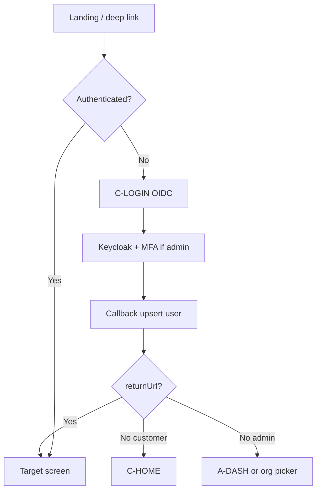

# UI flow — Auth & account

## Màn hình

### C-LOGIN / A-LOGIN / S-LOGIN

- Primary: nút “Đăng nhập với NexaTicket” → IdP.
- Không form password local trên app.
- Admin/scanner: copy nhắc MFA nếu role yêu cầu.

### Invite member (admin)

1. A-MEMBERS: nhập email + role → gửi invite.
2. User login lần đầu → màn “Chấp nhận lời mời” (có thể là route `/invites/[token]` trên admin hoặc customer).
3. Thành công → A-DASH org đó.

### C-ACCOUNT

- Họ tên, email (read-only từ IdP nếu chưa hỗ trợ edit), SĐT optional.
- Link đăng xuất.

## Edge

| Case | UI |
| --- | --- |
| Refresh reuse detected | Force re-login |
| User không membership vào admin URL | “Chưa thuộc tổ chức” + contact |
| Platform admin | Org switcher + badge “Platform” |
