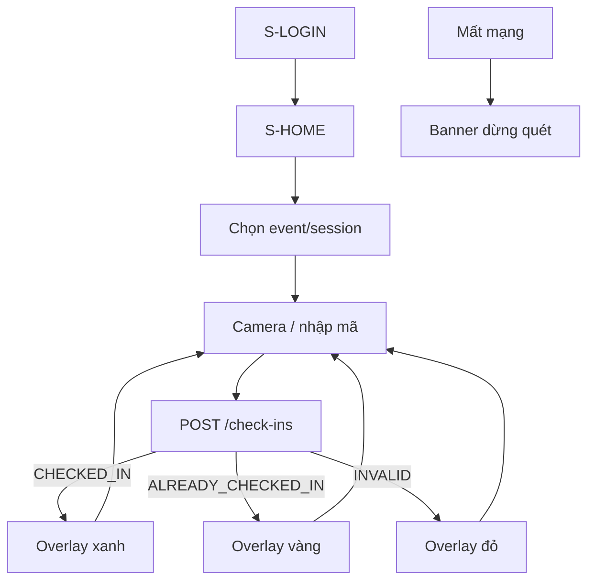

# UI flow — Check-in scanner



## S-HOME layout

```text
┌────────────────────────────┐
│ NexaTicket Scan · Online ● │
│ Event: Hòa Âm · Suất 19:00 │
├────────────────────────────┤
│                            │
│     Camera viewfinder      │
│                            │
├────────────────────────────┤
│ Hoặc dán mã vé             │
│ [____________] [Kiểm tra]  │
└────────────────────────────┘
```

## Overlay kết quả (bắt buộc lớn)

- **CHECKED_IN:** “Hợp lệ” + ghế `A-1-01` + tên event rút gọn.
- **ALREADY_CHECKED_IN:** “Đã check-in lúc HH:mm” — không âm thanh success trùng.
- **INVALID:** lý do (`Token hết hạn`, `Vé hủy`, …).

Tap / timeout 2.5s → sẵn sàng quét tiếp. Tránh double-submit: lock cho đến khi API trả.

## Trạng thái mạng

- Indicator Online/Offline góc.
- Offline: disable camera submit; copy “Cần mạng — MVP không quét offline”.

## Âm thanh / haptic (Should)

- Success: 1 beep ngắn.
- Already / fail: beep khác hoặc không beep.
