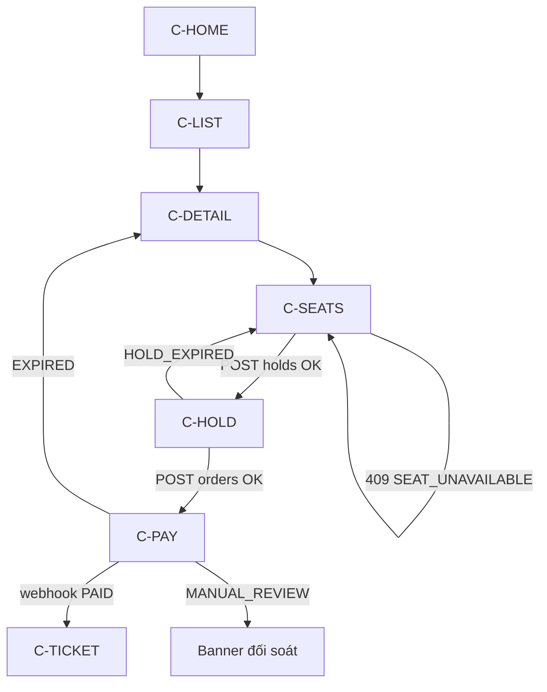

# UI flow — Customer purchase

Happy path: khám phá → ghế → giữ → thanh toán VietQR → vé.



## Bước màn hình

### 1. C-HOME

- First viewport: **NexaTicket** + headline 1 dòng + CTA “Xem sự kiện” + full-bleed visual.
- Không nhét search results / stats vào viewport đầu.

### 2. C-LIST

- Search query, city, date range.
- Kết quả: ảnh + title + city + date + giá từ — tap → C-DETAIL.
- Empty / error theo [states](../states.md).

### 3. C-DETAIL

- Title, mô tả, venue, session picker (nếu nhiều suất).
- Tier list giá (tham khảo); CTA chính: **Chọn ghế**.
- Chưa login: CTA vẫn vào C-SEATS; hold mới bắt login (hoặc login ngay trước hold).

### 4. C-SEATS (critical)

**Layout**

```text
┌─────────────────────────────────────┐
│ Event · Session · [05:00] nếu đang hold │
├─────────────────────────────────────┤
│         Seat map canvas             │
│         (WS live)                   │
├─────────────────────────────────────┤
│ Legend                              │
│ Tray: ghế đã chọn | Tổng | Giữ ghế  │
└─────────────────────────────────────┘
```

**Tương tác**

1. User tap AVAILABLE → local selected (max N ghế — config MVP ví dụ 8).
2. CTA **Giữ ghế** → login nếu cần → `POST /holds`.
3. Success → countdown hold bắt đầu; optional navigate C-HOLD hoặc tray chuyển mode “Đang giữ”.
4. Ghế HELD other / RESERVED / SOLD không chọn được; tooltip ngắn.
5. WS cập nhật màu; conflict → toast + bỏ selection ghế lỗi.

### 5. C-HOLD

- List ghế + giá + countdown 5p.
- Optional mã khuyến mãi.
- CTA **Tiếp tục thanh toán** → `POST /orders`.
- Secondary: Hủy giữ ghế.

### 6. C-PAY

```text
┌──────────────┐
│  Countdown   │
│  14:32       │
├──────────────┤
│  VietQR ảnh  │
│  lớn         │
├──────────────┤
│ Số tiền      │
│ Nội dung CK  │  [Copy]
│ NH · ****5678│
├──────────────┤
│ Trạng thái: Đang chờ chuyển khoản
│ [Tôi đã chuyển — kiểm tra lại]
└──────────────┘
```

- Copy reference 1 tap.
- Poll order status; khi PAID → success screen ngắn → C-TICKET.
- Cảnh báo: chuyển **đúng số tiền + nội dung**.

### 7. C-TICKET / C-TICKETS

- QR lớn (token); seat label; event time.
- Không hiện PII thừa trên QR image.
- C-ORDERS: timeline status đơn.

## Mobile notes

- Seat map: pinch-zoom Should; MVP pan + section filter chips.
- Bottom tray không che legend quan trọng.
- Ẩn bottom nav trên C-SEATS / C-PAY.

## Tracking (UI emit)

`event_view`, `seat_hold`, `order_created` — không block UI nếu analytics fail.
