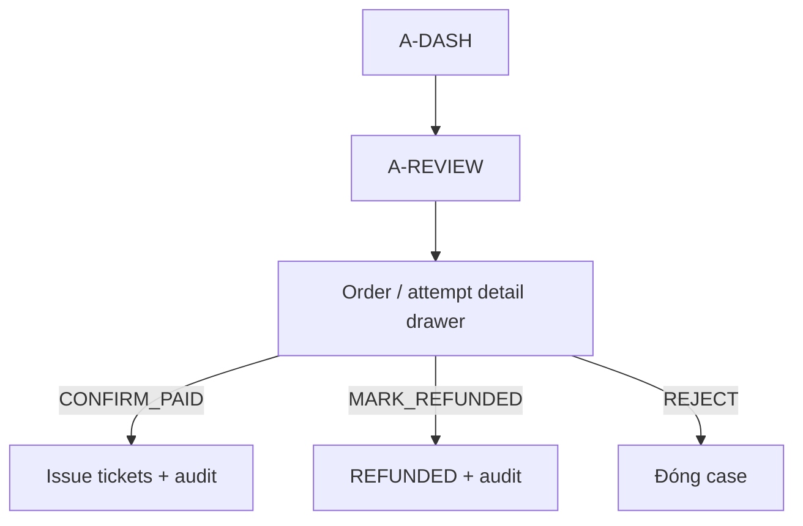

# UI flow — Dashboard & payment resolve

## A-DASH

Một composition metrics — không card-soup:

| Block | Nội dung |
| --- | --- |
| Filter | Event, session, khoảng ngày |
| GMV | Số VND lớn |
| Đơn | paid / awaiting / expired / review |
| Ghế | available / held / reserved / sold — horizontal bar hoặc 4 số |

CTA: “Xem đối soát” nếu `manualReview > 0`.

## A-REVIEW

Table: thời gian, reference, amount expected/received, reason, order link.

Drawer actions (ORG_ADMIN+):

1. Confirm paid — confirm modal “Phát hành vé”.
2. Mark refunded — bắt buộc nhập reason.
3. Reject — reason.

Mọi action hiện toast + dòng audit preview (actor, timestamp).

## Refund từ order (A-REFUND)

Từ order PAID chưa check-in: nút Hoàn tiền → modal reason → status REFUNDED; vé cập nhật; copy cảnh báo hoàn tiền ngân hàng ngoài hệ thống.
