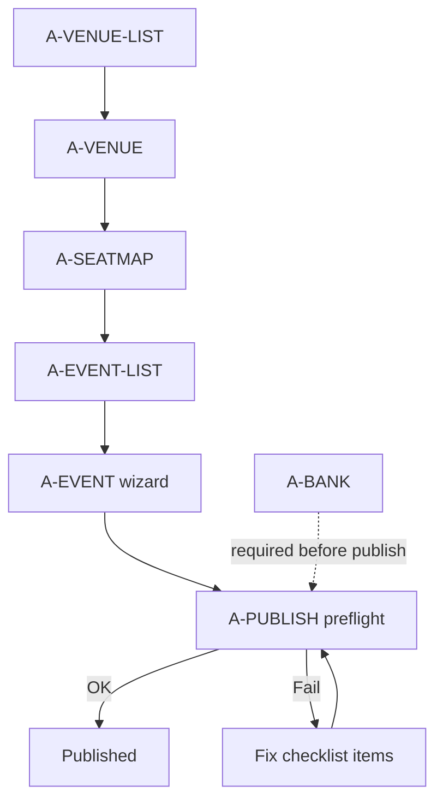

# UI flow — Organizer publish

## Wizard A-EVENT (steps UI)

| Step | Nội dung | Validation |
| --- | --- | --- |
| 1. Thông tin | Title, slug, mô tả, ảnh, venue, seat map | Slug unique |
| 2. Suất diễn | starts_at, sales window | sales overlaps hợp lệ |
| 3. Hạng vé | Tên + giá VND | ≥1 tier |
| 4. Gán ghế | Chọn section/row → tier | Mọi ghế bán được có tier |
| 5. Xem lại | Summary | — |

Progress indicator cố định; Save draft mỗi step.

## A-SEATMAP

- Mode A: bảng/grid thêm row nhanh (section, row, seat from–to).
- Mode B: upload CSV template.
- Preview số ghế; Activate map (confirm dialog archive map cũ).

## A-PUBLISH

Checklist visual:

- [ ] Seat map ACTIVE
- [ ] Mọi ghế có tier
- [ ] Có bank account active
- [ ] Sales window hợp lệ

CTA Publish disabled đến khi all green. Lỗi API map sang item đỏ.

Sau publish: banner “Đang bán” + link mở C-DETAIL public.

## A-BANK

- Form: bank code (select NH VN), số TK, tên TK.
- List chỉ `****last4`.
- Toggle active / preferred.

## A-PROMO / A-MEMBERS

- Table + drawer tạo/sửa; không multi-page phức tạp.

## Permissions UI

Ẩn nav item nếu role thiếu quyền (không chỉ 403 sau click). Badge role trên members.
