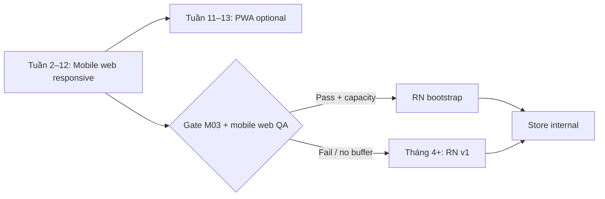

# Mobile documentation

Tài liệu đầy đủ cho kênh mobile: **mobile web (MVP 3 tháng)** và **React Native customer (v1)**.

| Artifact | Nội dung |
| --- | --- |
| [Strategy & phasing](README.md#phasing) | Khi nào làm web / PWA / RN |
| [Navigation](navigation.md) | Tab, stack, focus mode |
| [Screen inventory](screen-inventory.md) | Index màn mobile |
| [Screen specs (chi tiết)](screens/README.md) | Từng màn web mobile + RN + scanner |
| [Flow: Purchase](flows/purchase.md) | Discovery → vé trên điện thoại |
| [Flow: Auth](flows/auth.md) | OIDC mobile web + RN |
| [Flow: Tickets & orders](flows/tickets.md) | Vé, QR gate, đơn |
| [Seat map UX](seat-map-ux.md) | Pan/zoom, tray, WS, a11y |
| [Payment VietQR](payment-vietqr.md) | QR, copy, banking handoff |
| [States](states.md) | Network, background, countdown |
| [Design native](design-native.md) | Token RN, touch, safe area |
| [Technical RN](technical-rn.md) | Stack, folders, API, WS, storage |
| [Deep links](deep-links.md) | URL, Universal / App Links |
| [PWA](pwa.md) | Manifest, SW shell |
| [Scanner mobile web](scanner-mobile.md) | Check-in trên điện thoại staff |
| [QA checklist](qa-checklist.md) | Thiết bị & gate |
| [Delivery backlog](delivery.md) | Sprint RN sau web |

## Phasing

| Phase | Deliverable | Gate |
| --- | --- | --- |
| **M-Web** (trong 13 tuần) | Customer + scanner dùng tốt trên phone browser | Go-live Must |
| **M-PWA** (optional tuần 11–13) | Add to Home Screen | Nice |
| **M-RN-v1** (sau M03 hoặc tháng 4+) | App customer parity purchase | Store internal |
| **M-RN-v2** (sau) | Push, widget, polish camera scanner native | Evidence-based |

**Không native:** admin organizer, platform admin.

## Invariant (giống web)

Server authoritative; hold 5p / payment 15p; idempotency; không oversell; QR không PII; online-only check-in.
