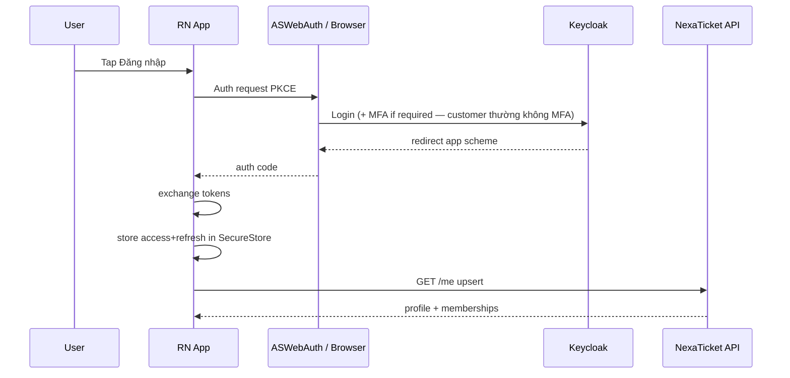

# Mobile flow — Auth

## Mobile web

1. Tap hành động cần login → `/login?returnUrl=...`.
2. Redirect Keycloak (Authorization Code + PKCE qua BFF hoặc next-auth style).
3. Callback → restore returnUrl (SeatMap giữ `sessionStorage` selection key ngắn hạn).

## React Native

### Token storage

| Item | Where |
| --- | --- |
| access_token | SecureStore / Keychain |
| refresh_token | SecureStore |
| expires_at | SecureStore hoặc memory + SecureStore |

- Không lưu token trong AsyncStorage plain.
- On 401: one refresh attempt; fail → AuthStack.
- Biometric unlock app (Should v1.1): không thay MFA IdP.

### App scheme

- Dev: `nexaticket://auth/callback`
- Prod: `https://app.nexaticket.vn/auth/callback` (Universal Link) + scheme fallback

### Guest browse

- Welcome: “Xem sự kiện” không login.
- Hold: bắt login; sau login không mất selection nếu `expires` local selection &lt; 2 phút và seats vẫn AVAILABLE (re-validate).

### Đăng xuất

- Revoke refresh nếu IdP hỗ trợ; clear SecureStore; reset nav về Welcome/Home guest.
