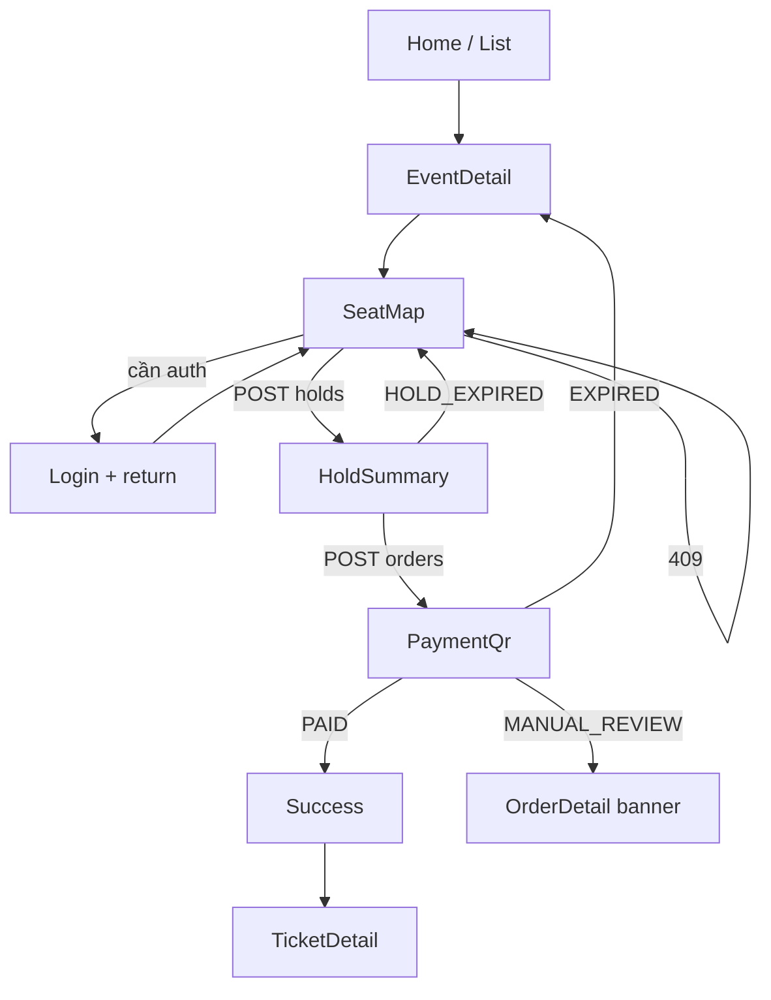

# Mobile flow — Purchase

Áp dụng **mobile web** và **RN** (cùng bước nghiệp vụ; khác chrome).



## Chi tiết từng bước (điện thoại)

### Home / EventList

- Thumb reach: search icon top; filter FAB hoặc top-right mở sheet: city, date.
- Card: ảnh 16:9, title 2 dòng max, city · date, “từ xxx₫”.
- Tránh carousel stats.

### EventDetail

```text
┌─────────────────────┐
│ ←    NexaTicket     │
│ [full-bleed image]  │
│ Title               │
│ Venue · City        │
│ Session chips       │
│ Mô tả (collapse)    │
│ Hạng vé (list giá)  │
├─────────────────────┤
│ [    Chọn ghế     ] │  sticky
└─────────────────────┘
```

### SeatMap → Hold → Pay

Xem [seat-map-ux.md](../seat-map-ux.md) và [payment-vietqr.md](../payment-vietqr.md).

### Resume order

User kill app khi `AWAITING_PAYMENT`:

1. Mở app → Tickets/Orders hoặc deep link email.
2. `OrderDetail` status AWAITING + còn hạn → CTA “Tiếp tục thanh toán” → PaymentQr (cùng QR/reference từ API, không tạo order mới).
3. Hết hạn → copy hết hạn + CTA về EventDetail.

### Multi-seat

- Max seats / order: config `MAX_SEATS_PER_HOLD` (MVP đề xuất **8**).
- Tray hiện số ghế + tổng tiền live (giá từ seat/tier đã load).

### Analytics

Emit cùng taxonomy web; RN thêm `platform: ios|android` trong payload analytics (không PII).
